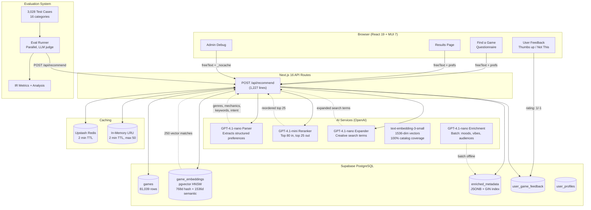
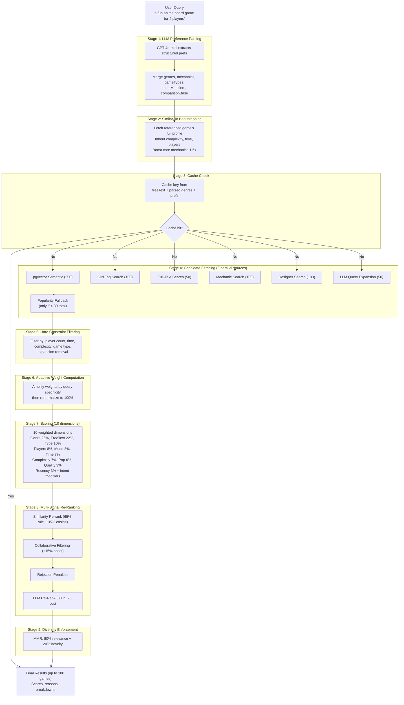
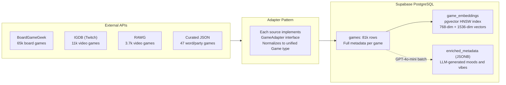
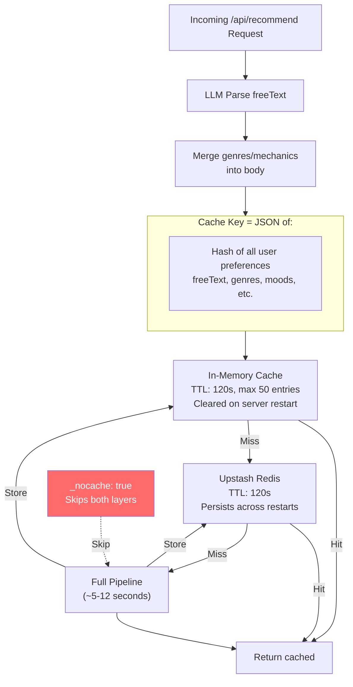
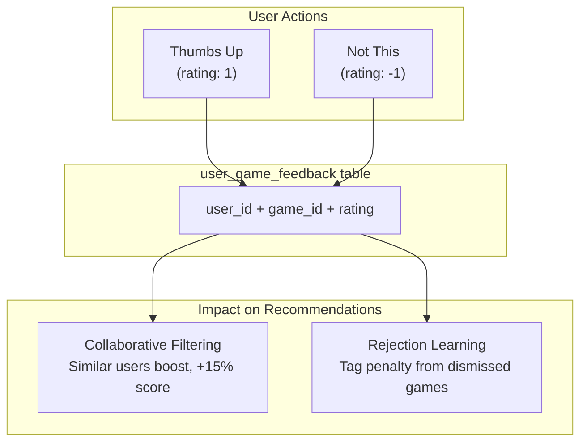
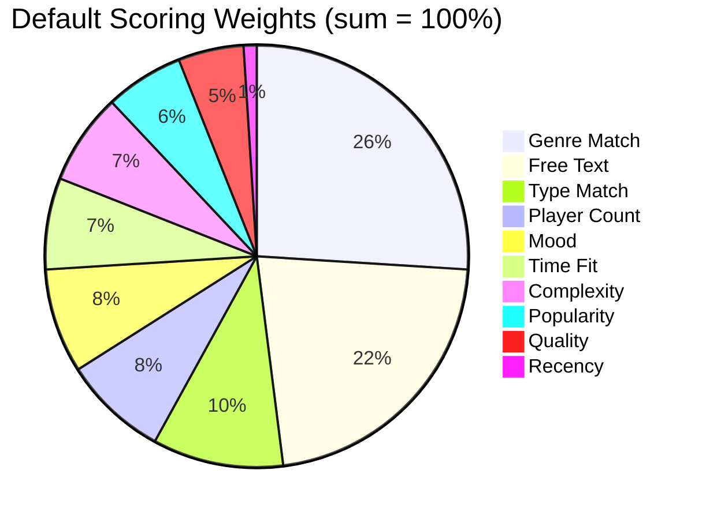
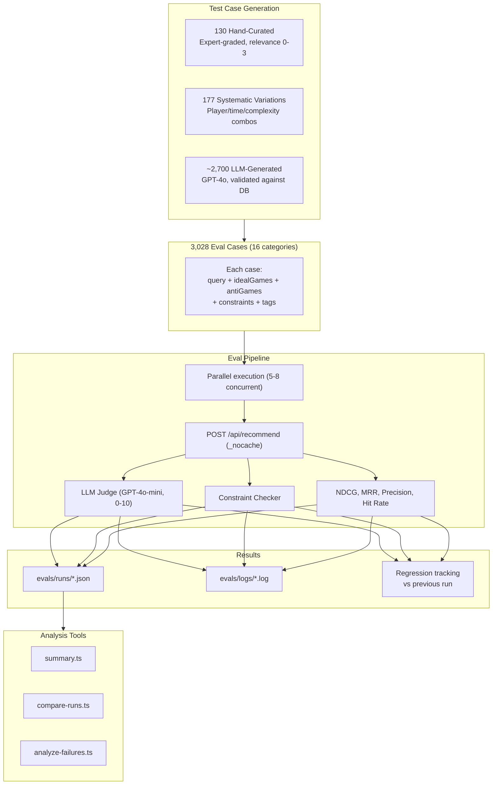

# Architecture

System architecture for boredgame.lol. Last updated April 2026.

See also: [TECHNICAL-REVIEW-PACKET.md](TECHNICAL-REVIEW-PACKET.md) for a comprehensive review document covering architecture, evaluation, research, and known issues.

---

## High-Level Overview

---

## Recommendation Pipeline (9 Stages)

### Candidate Deduplication

Deduplication happens **per-request, in-memory** -- not as a batch or offline process. This is necessary because the 7+ parallel candidate sources (franchise, canonical, designer, mechanic, vector, tag, text, LLM expansion) can each return the same game.

- **How:** A `Set<string>` of game IDs merges candidates in priority order: franchise > canonical > designer > mechanic > vector > tag > text > expanded. The first source to contribute a game "wins" its priority slot.
- **Cost:** O(1) per game via `Set.has()`. With ~600 total candidates across all sources, dedup takes microseconds -- negligible compared to DB queries and LLM calls.
- **Why per-request?** Candidate composition changes with every query. A popular strategy game like Catan might appear in vector results, tag results, AND text results for one query but only in vector results for another.

---

## Data Sources & Ingestion

---

## Caching Architecture

---

## User Feedback Loop

---

## Scoring Weight Distribution

Weights are adaptive: if the user specifies a tight player count (e.g., exactly 4), that dimension gets a 2x boost, then all weights renormalize to 100%. Additional adaptive rules:
- Hard time constraint ("under 90 min"): time weight gets 2.5x boost
- Narrow complexity range: complexity weight gets 2x boost
- Broad query (few constraints): quality and popularity each get 4x boost as tiebreaker
- Multiple moods specified: mood weight gets 1.5x boost

**Hidden Gems mode** uses a different base profile: popularity drops to 0%, quality rises to 15%.

---

## Evaluation System

The eval system measures recommendation quality objectively. It runs real queries against the API and checks results against curated ground truth.

**Current baseline (307 cases):** 68.4% pass rate, 7.14/10 LLM judge, 0.9855 NDCG@10, 1.0% constraint violations.

See [evals/EVAL-OVERVIEW.md](../evals/EVAL-OVERVIEW.md) for the complete eval system guide and [TECHNICAL-REVIEW-PACKET.md](TECHNICAL-REVIEW-PACKET.md) for detailed results and analysis.

---

## Tech Stack

| Layer | Technology | Notes |
|-------|-----------|-------|
| Framework | Next.js 16 (App Router) | Server components, API routes, SSR |
| UI | React 19 + MUI 7 | Material Design components |
| Language | TypeScript 5 | Strict mode |
| Auth | Supabase Auth | Email/password + Google OAuth |
| Database | Supabase PostgreSQL | Games, user profiles, feedback |
| Vector Search | pgvector (HNSW) | 768-dim hash + 1536-dim semantic embeddings |
| AI | OpenAI (GPT-4o, GPT-4o-mini) | Parsing, reranking, query expansion, enrichment |
| Embeddings | text-embedding-3-small | 1536-dim semantic vectors |
| Cache | Upstash Redis + in-memory | 2 min TTL, 50-entry in-memory LRU |
| Animations | Motion (Framer Motion) | Page transitions, scroll animations |
| Testing | Vitest + React Testing Library | Unit + integration tests |
| Deployment | Vercel | Serverless functions |

---

## Key File Locations

| Area | Files |
|------|-------|
| **Recommendation API** | `src/app/api/recommend/route.ts` |
| **Scoring Engine** | `src/lib/recommendation/scoring.ts` |
| **LLM Parser** | `src/lib/llm/parse-preferences.ts` |
| **LLM Reranker** | `src/lib/recommendation/llm-rerank.ts` |
| **Vector Similarity** | `src/lib/recommendation/similarity.ts`, `semantic-embeddings.ts` |
| **Collaborative Filter** | `src/lib/recommendation/collaborative.ts` |
| **Rejection Learning** | `src/lib/recommendation/rejection.ts` |
| **Diversity** | `src/lib/recommendation/diversity.ts` |
| **Query Expansion** | `src/lib/recommendation/llm-query-expand.ts` |
| **Redis Cache** | `src/lib/redis.ts` |
| **BGG Adapter** | `src/lib/adapters/bgg.ts` |
| **IGDB Adapter** | `src/lib/adapters/igdb.ts` |
| **Game DB Layer** | `src/lib/supabase/games.ts` |
| **Admin Debug** | `src/app/admin/debug/page.tsx` |
| **Results Page** | `src/app/results/ResultsView.tsx` |
| **Questionnaire** | `src/app/find-a-game/QuestionnaireFlow.tsx` |
