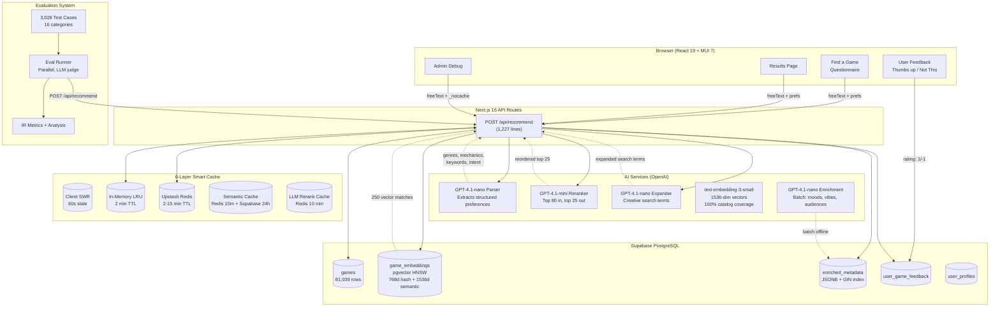
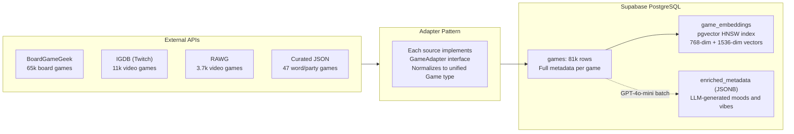
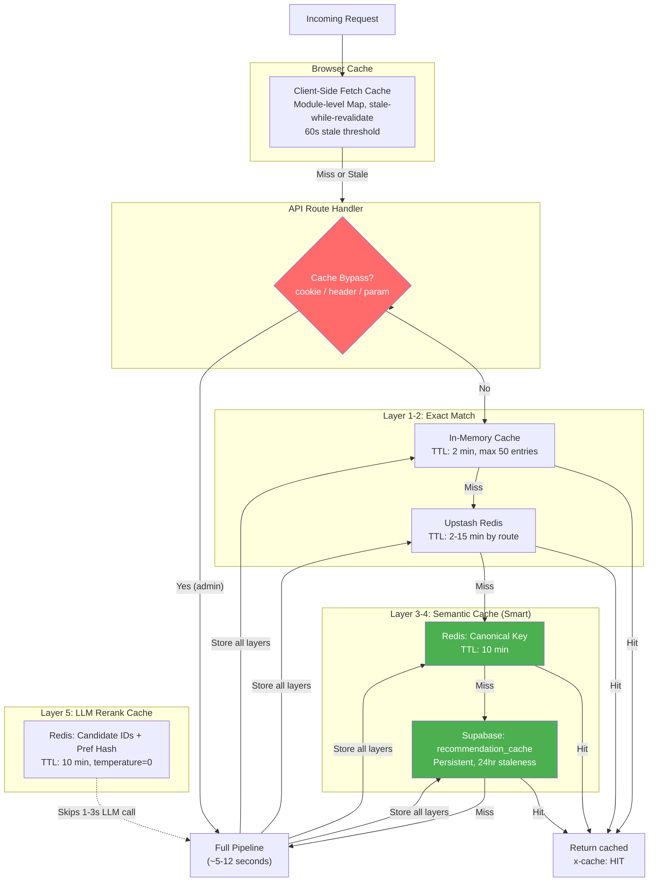
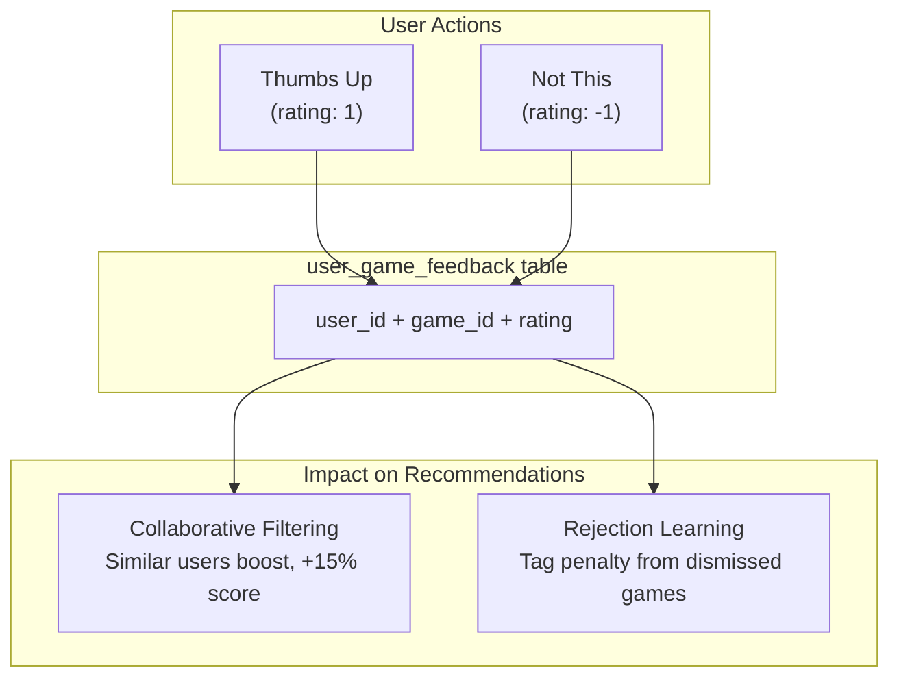
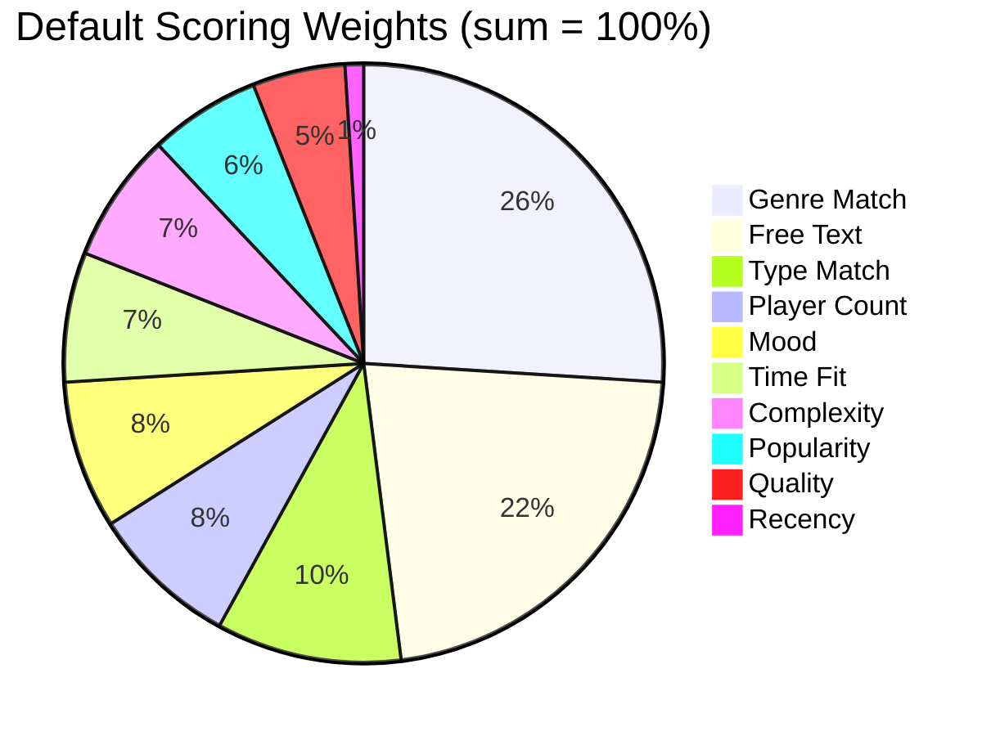
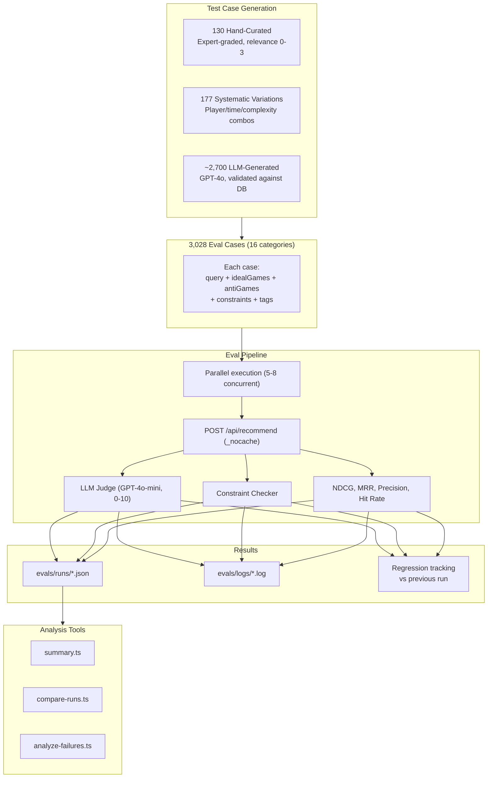

# Architecture

System architecture for boredgame.lol. Last updated April 2026.

See also: [TECHNICAL-REVIEW-PACKET.md](TECHNICAL-REVIEW-PACKET.md) for a comprehensive review document covering architecture, evaluation, research, and known issues.

---

## High-Level Overview

---

## Recommendation Pipeline (9 Stages)

### Candidate Deduplication

> **"Data sources" vs. "retrieval strategies"** -- these are different things. Data sources (BGG, IGDB, RAWG, local JSON) are where games are *imported from* during batch ingestion. They all land in a single unified `games` table (81k rows). Retrieval strategies are the 7+ different *ways of querying that same table* at recommendation time. Dedup is about the latter, not the former.

All 81k games live in one table. There's no duplication problem at the storage level. The dedup problem arises because we query that single table through multiple retrieval strategies in parallel, and those strategies return overlapping results. For example, a query about "deck building games" might find Dominion via:

- **Vector search** (semantic embedding is close to "deck building")
- **Tag search** (has "Deck Building" in its mechanics array)
- **Mechanic search** (direct mechanic overlap with aliases)
- **Text search** ("Dominion" matched by name)
- **Canonical games** (hardcoded as the quintessential deck builder)

That's the same game appearing in 5 result sets from 5 different queries against the same table.

**Why not just run one big query?** Each retrieval strategy uses different indexes and matching logic (pgvector HNSW for vectors, GIN for array overlaps, full-text search for names/descriptions, ILIKE for designers). There's no single SQL query that efficiently combines all of these. Running them in parallel with different indexes is faster than one monolithic query scoring all 81k games.

**How dedup works:** A `Set<string>` of game IDs merges candidates in priority order: franchise > canonical > designer > mechanic > vector > tag > text > expanded. The first strategy to contribute a game "wins" its slot. This is just bookkeeping about insertion order -- it doesn't affect final scoring or ranking.

**Cost:** O(1) per game via `Set.has()`. With ~600 total candidates across all strategies, dedup takes microseconds -- negligible compared to DB queries and LLM calls.

**Why per-request?** Which strategies find which games changes with every query. Catan might appear in vector, tag, AND text results for one query but only vector results for another.

---

## Data Sources & Ingestion

---

## Caching Architecture (6-Layer Smart Cache Stack)

The caching system spans from the browser through the API into persistent storage. The "smart" layer (Semantic Recommendation Cache) uses canonical keys derived from LLM-parsed preferences, so different phrasing of the same request ("deck building for 2" vs "2 player deck builders") produces cache hits.

### Cache Layers

| Layer | Location | TTL | What It Caches |
|-------|----------|-----|----------------|
| Client fetch cache | Browser Map | 60s stale | All GET responses (trending, browse, game detail, similar) |
| In-memory (exact match) | Server MemoryCache | 2 min | Recommend responses, identical raw prefs |
| Redis (exact match) | Upstash | 2-15 min | Per-route: recommend (2m), browse (15m), trending (6h), game detail (10m) |
| Semantic cache (Redis) | Upstash | 10 min | Canonical parsed prefs (cross-user, different text = same key) |
| Semantic cache (Supabase) | `recommendation_cache` table | 24h stale | Persistent across deploys, survives Redis eviction |
| LLM rerank cache | Upstash | 10 min | Reranking results keyed by candidate IDs + preference summary |

### Cache Bypass (Admin)

Admins can bypass all caching for testing via any of:
- **Cookie**: `__nocache=1` (toggled via profile dropdown "Skip Cache" switch)
- **Header**: `X-No-Cache: 1`
- **Query param**: `?nocache=1`

When bypass is active, cache reads are skipped but writes still execute (so other users benefit from the fresh computation). All API responses include an `x-cache: HIT` or `x-cache: MISS` header for debugging.

### Semantic Cache: How "Smart" Works

1. User types "deck building games for 2 players"
2. LLM parses to: `{ mechanics: ["Deck Building"], playerCount: {min:2, max:2} }`
3. Canonical key built from parsed prefs (freeText deliberately excluded)
4. Hash checked against Redis, then Supabase `recommendation_cache`
5. Another user types "2 player deck builders" -- same canonical key -- instant hit

The canonical key includes: sorted gameTypes, genres, mechanics, moods, playerCount, complexity, timePresets, similarTo, designers, keywords, and popularity mode. Default/empty values are omitted to maximize hit rates.

---

## User Feedback Loop

---

## Scoring Weight Distribution

Weights are adaptive: if the user specifies a tight player count (e.g., exactly 4), that dimension gets a 2x boost, then all weights renormalize to 100%. Additional adaptive rules:
- Hard time constraint ("under 90 min"): time weight gets 2.5x boost
- Narrow complexity range: complexity weight gets 2x boost
- Broad query (few constraints): quality and popularity each get 4x boost as tiebreaker
- Multiple moods specified: mood weight gets 1.5x boost

**Hidden Gems mode** uses a different base profile: popularity drops to 0%, quality rises to 15%.

---

## Evaluation System

The eval system measures recommendation quality objectively. It runs real queries against the API and checks results against curated ground truth.

**Current baseline (307 cases):** 68.4% pass rate, 7.14/10 LLM judge, 0.9855 NDCG@10, 1.0% constraint violations.

See [evals/EVAL-OVERVIEW.md](../evals/EVAL-OVERVIEW.md) for the complete eval system guide and [TECHNICAL-REVIEW-PACKET.md](TECHNICAL-REVIEW-PACKET.md) for detailed results and analysis.

---

## Tech Stack

| Layer | Technology | Notes |
|-------|-----------|-------|
| Framework | Next.js 16 (App Router) | Server components, API routes, SSR |
| UI | React 19 + MUI 7 | Material Design components |
| Language | TypeScript 5 | Strict mode |
| Auth | Supabase Auth | Email/password + Google OAuth |
| Database | Supabase PostgreSQL | Games, user profiles, feedback |
| Vector Search | pgvector (HNSW) | 768-dim hash + 1536-dim semantic embeddings |
| AI | OpenAI (GPT-4o, GPT-4o-mini) | Parsing, reranking, query expansion, enrichment |
| Embeddings | text-embedding-3-small | 1536-dim semantic vectors |
| Cache | 6-layer smart cache stack | Client SWR + in-memory + Redis + semantic (Redis + Supabase) + LLM rerank cache |
| Animations | Motion (Framer Motion) | Page transitions, scroll animations |
| Testing | Vitest + React Testing Library | Unit + integration tests |
| Deployment | Vercel | Serverless functions |

---

## Key File Locations

| Area | Files |
|------|-------|
| **Recommendation API** | `src/app/api/recommend/route.ts` |
| **Scoring Engine** | `src/lib/recommendation/scoring.ts` |
| **LLM Parser** | `src/lib/llm/parse-preferences.ts` |
| **LLM Reranker** | `src/lib/recommendation/llm-rerank.ts` |
| **Vector Similarity** | `src/lib/recommendation/similarity.ts`, `semantic-embeddings.ts` |
| **Collaborative Filter** | `src/lib/recommendation/collaborative.ts` |
| **Rejection Learning** | `src/lib/recommendation/rejection.ts` |
| **Diversity** | `src/lib/recommendation/diversity.ts` |
| **Query Expansion** | `src/lib/recommendation/llm-query-expand.ts` |
| **Redis Cache** | `src/lib/redis.ts` |
| **Cache Bypass** | `src/lib/cache-bypass.ts` |
| **Semantic Cache** | `src/lib/recommendation/semantic-cache.ts` |
| **Client Cache** | `src/lib/client-cache.ts`, `src/hooks/useCachedFetch.ts` |
| **BGG Adapter** | `src/lib/adapters/bgg.ts` |
| **IGDB Adapter** | `src/lib/adapters/igdb.ts` |
| **Game DB Layer** | `src/lib/supabase/games.ts` |
| **Admin Debug** | `src/app/admin/debug/page.tsx` |
| **Results Page** | `src/app/results/ResultsView.tsx` |
| **Questionnaire** | `src/app/find-a-game/QuestionnaireFlow.tsx` |
