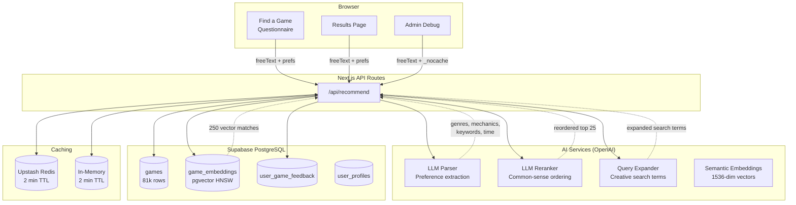
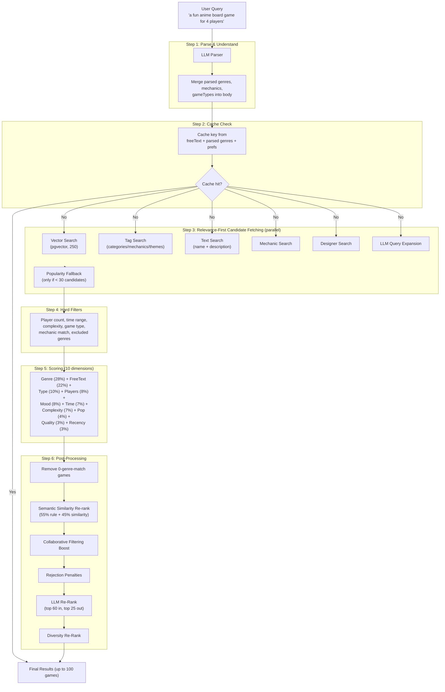
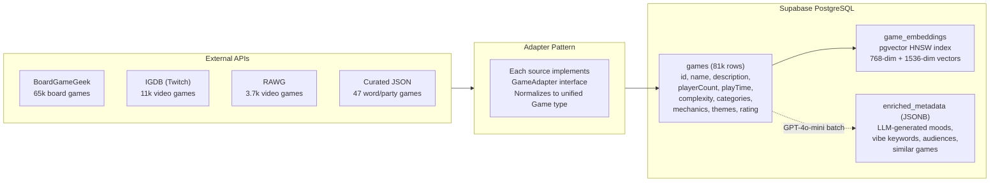
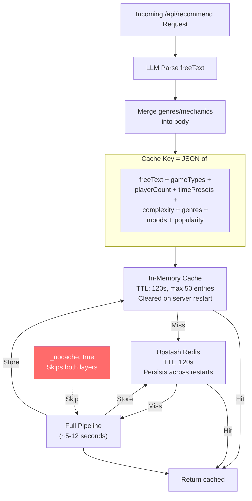
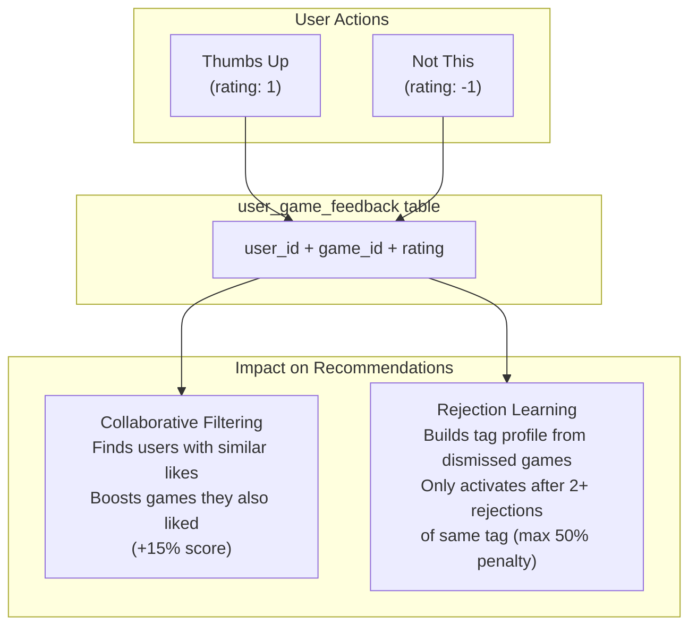
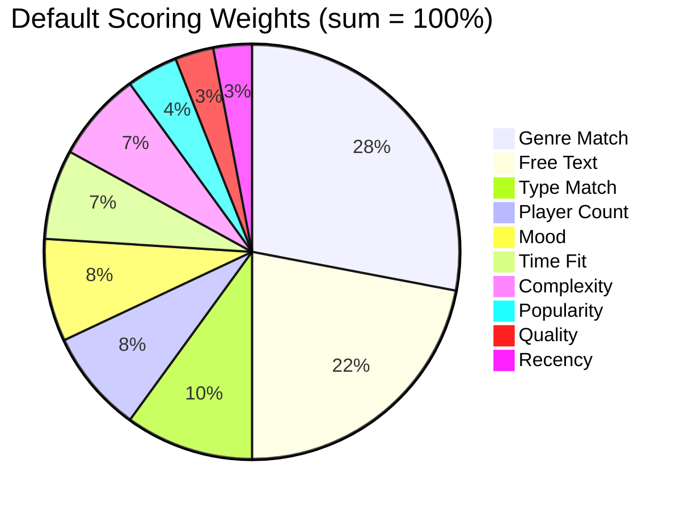

# Architecture

System architecture for boredgame.lol. Last updated April 2026.

---

## High-Level Overview

---

## Recommendation Pipeline

---

## Data Sources & Ingestion

---

## Caching Architecture

---

## User Feedback Loop

---

## Scoring Weight Distribution

Weights are adaptive: if the user specifies a tight player count (e.g., exactly 4), that dimension gets a 2x boost, then all weights renormalize to 100%.

---

## Tech Stack

| Layer | Technology | Notes |
|-------|-----------|-------|
| Framework | Next.js 16 (App Router) | Server components, API routes, SSR |
| UI | React 19 + MUI 7 | Material Design components |
| Language | TypeScript 5 | Strict mode |
| Auth | Supabase Auth | Email/password + Google OAuth |
| Database | Supabase PostgreSQL | Games, user profiles, feedback |
| Vector Search | pgvector (HNSW) | 768-dim hash + 1536-dim semantic embeddings |
| AI | OpenAI (GPT-4o, GPT-4o-mini) | Parsing, reranking, query expansion, enrichment |
| Embeddings | text-embedding-3-small | 1536-dim semantic vectors |
| Cache | Upstash Redis + in-memory | 2 min TTL, 50-entry in-memory LRU |
| Animations | Motion (Framer Motion) | Page transitions, scroll animations |
| Testing | Vitest + React Testing Library | Unit + integration tests |
| Deployment | Vercel | Serverless functions |

---

## Key File Locations

| Area | Files |
|------|-------|
| **Recommendation API** | `src/app/api/recommend/route.ts` |
| **Scoring Engine** | `src/lib/recommendation/scoring.ts` |
| **LLM Parser** | `src/lib/llm/parse-preferences.ts` |
| **LLM Reranker** | `src/lib/recommendation/llm-rerank.ts` |
| **Vector Similarity** | `src/lib/recommendation/similarity.ts`, `semantic-embeddings.ts` |
| **Collaborative Filter** | `src/lib/recommendation/collaborative.ts` |
| **Rejection Learning** | `src/lib/recommendation/rejection.ts` |
| **Diversity** | `src/lib/recommendation/diversity.ts` |
| **Query Expansion** | `src/lib/recommendation/llm-query-expand.ts` |
| **Redis Cache** | `src/lib/redis.ts` |
| **BGG Adapter** | `src/lib/adapters/bgg.ts` |
| **IGDB Adapter** | `src/lib/adapters/igdb.ts` |
| **Game DB Layer** | `src/lib/supabase/games.ts` |
| **Admin Debug** | `src/app/admin/debug/page.tsx` |
| **Results Page** | `src/app/results/ResultsView.tsx` |
| **Questionnaire** | `src/app/find-a-game/QuestionnaireFlow.tsx` |
