# boredgame.lol -- Technical Review

:::info
**How to give feedback:** Click any line and use the comment icon to leave inline comments. I'll reply to everything. Ask me to show code if you want to see the actual implementation of anything described here.
:::

## What is boredgame.lol?

[boredgame.lol](https://boredgame.lol) is a smart game recommendation engine. You describe what you're looking for in plain English -- "a chill 2-player game for date night," "deck building game under 30 minutes," "something like Catan but less random" -- and it searches 81,000+ board games and video games to find ranked, explained recommendations.

The engine doesn't just match keywords. It understands what you mean. "Chill" becomes a complex mood signal (low complexity + short playtime + intimate player count). "Like Catan" fetches Catan's actual mechanics and finds games that play similarly. "Under 30 minutes" applies hard time constraints with appropriate grace periods.

Every result comes with human-readable reasons explaining why it was recommended, and you can train the engine on your preferences by giving thumbs up/down feedback.

## How it was built

One person + Claude (AI pair programmer). Entirely vibe-coded over ~4 weeks. The recommendation architecture is informed by academic research (Raza et al. 2024, 287-paper survey; Koch/Criteo, 6 years practitioner; Rendle et al., BPR) but implemented pragmatically in TypeScript rather than Python ML pipelines.

The engine has been iterated through a 3,028-case evaluation suite that tests 16 categories of queries with automated LLM-as-judge scoring and information retrieval metrics.

## What I want feedback on

1. Is the recommendation architecture sound, or are there fundamental design flaws?
2. Is the evaluation methodology measuring the right things? Blind spots?
3. Are the scoring weights and pipeline stages ordered correctly?
4. What would you change first if you inherited this codebase?
5. Are there obvious best practices I'm violating?

---

## Table of Contents

[TOC]

---

# Part 1: System Overview

## Tech Stack

| Layer | Technology | Notes |
|-------|-----------|-------|
| Framework | Next.js 16 (App Router) | Server components, API routes, SSR |
| UI | React 19 + MUI 7 | Material Design components |
| Language | TypeScript 5 | Strict mode |
| Auth | Supabase Auth | Email/password + Google OAuth |
| Database | Supabase PostgreSQL | 81k games, user profiles, feedback |
| Vector Search | pgvector (HNSW) | 768-dim hash + 1536-dim semantic embeddings |
| AI | OpenAI GPT-4o / GPT-4o-mini | Parsing, reranking, query expansion, metadata enrichment |
| Embeddings | text-embedding-3-small | 1536-dim semantic vectors, 100% catalog coverage |
| Cache | Upstash Redis + in-memory LRU | 2 min TTL, 50-entry in-memory |
| Testing | Vitest + React Testing Library | Unit + integration tests |
| Eval | Custom TypeScript framework | 3,028 cases, IR metrics, LLM-as-judge |
| Deployment | Vercel | Serverless functions |

## End-to-End Architecture

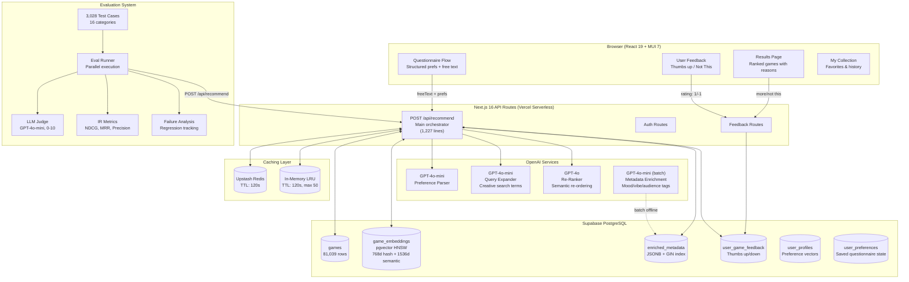

## Request Lifecycle (Latency Budget)

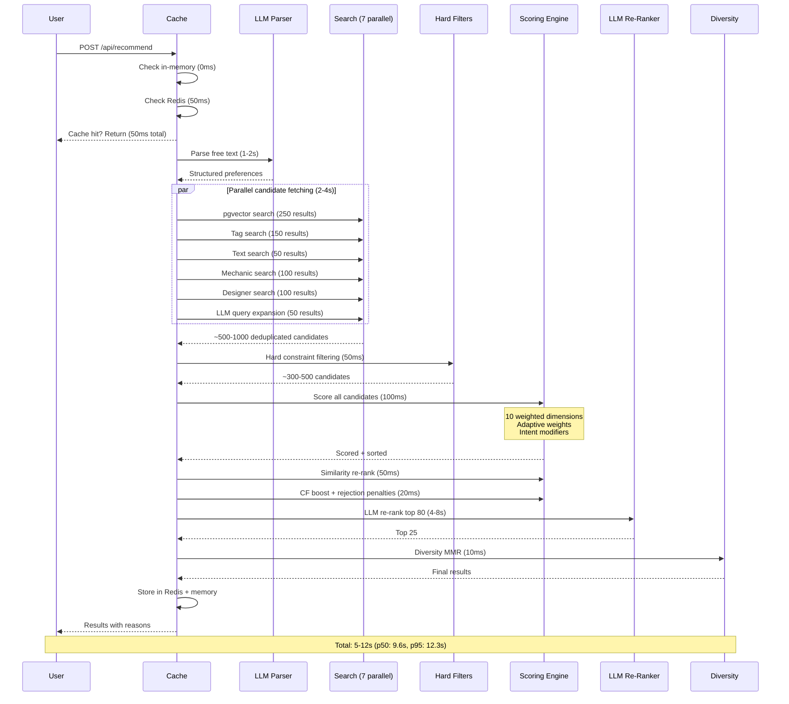

## Data Sources

Every external game source implements a `GameAdapter` interface and normalizes to a unified `Game` type.

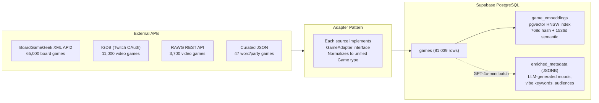

---

# Part 2: Recommendation Pipeline (Deep Dive)

:::info
**Why this matters:** The pipeline is the heart of the system. Each stage exists because of a specific quality problem we observed. For example, Stage 4 uses 7 parallel search strategies because no single method finds all the right games -- vector search finds semantically similar games, mechanic search catches exact matches, and canonical game injection guarantees the obvious famous answers enter the pool.
:::

Every recommendation request flows through **9 stages**. This is the core of the system.

## Stage-by-Stage Pipeline

```mermaid
flowchart TD
    INPUT["User Input<br/>'a fun anime board game for 4 players'"]

    subgraph S1["Stage 1: LLM Preference Parsing"]
        direction LR
        PARSE["GPT-4o-mini extracts:"]
        OUT["Structured output: genres, mechanics,<br/>moods, complexity, playerCount,<br/>designers, similarTo, intentModifiers"]
    end

    subgraph S2["Stage 2: Similar-To Bootstrapping"]
        direction LR
        FETCH["Fetch referenced game's full profile"]
        INHERIT["Inherit complexity, player count,<br/>time range, boost core mechanics 1.5x"]
    end

    subgraph S3["Stage 3: Cache Check"]
        KEY["Cache key = hash of<br/>freeText + parsed genres + all prefs"]
        HIT{Hit?}
    end

    subgraph S4["Stage 4: Candidate Generation (parallel)"]
        VEC["pgvector Semantic<br/>250 candidates"]
        TAG["GIN Index Tags<br/>150 candidates"]
        TXT["Full-Text Search<br/>50 candidates"]
        MECH["Mechanic Search<br/>100 candidates"]
        DES["Designer Search<br/>100 candidates"]
        EXP["LLM Query Expand<br/>50 candidates"]
        CAN["Canonical Game Injection<br/>30+ mechanic/category maps"]
        POP["Popularity Fallback<br/>(only if < 30 total)"]
    end

    subgraph S5["Stage 5: Hard Constraint Filtering"]
        FILT["Filter by: player count, time,<br/>complexity, game type,<br/>expansion removal"]
    end

    subgraph S6["Stage 6: Adaptive Weight Computation"]
        AW["Amplify weights by query specificity<br/>e.g. tight player count 2x,<br/>hard time 2.5x, broad query 6x pop<br/>Then renormalize to 100%"]
    end

    subgraph S7["Stage 7: Rule-Based Scoring (10 dimensions)"]
        SCORE["10 weighted dimensions<br/>Genre 26%, FreeText 22%, Type 10%<br/>Players 8%, Mood 8%, Time 7%<br/>Complexity 7%, Pop 6%, Quality 3%<br/>Recency 3% + intent modifiers"]
    end

    subgraph S8["Stage 8: Multi-Signal Re-Ranking"]
        SIM["Similarity Re-Rank<br/>65% rule + 35% cosine similarity"]
        CF["Collaborative Filtering<br/>+15% boost for CF signals"]
        REJ["Rejection Learning<br/>Penalty from 'Not This' history"]
        LLM_RR["LLM Re-Rank<br/>GPT-4o: 80 in, 25 out"]
    end

    subgraph S9["Stage 9: Diversity Enforcement"]
        DIV["Maximal Marginal Relevance<br/>88% relevance + 12% novelty<br/>Applied to top 30"]
    end

    OUTPUT["Final Output<br/>Up to 100 games with<br/>scores, reasons, breakdowns"]

    INPUT --> S1 --> S2 --> S3
    S3 -->|Miss| S4
    S3 -->|Hit| OUTPUT
    S4 --> S5 --> S6 --> S7 --> S8 --> S9 --> OUTPUT
```

## Candidate Generation Detail

:::info
**Why 7 sources?** Each source catches games the others miss. Vector search finds semantically similar games but doesn't guarantee famous ones. Text search finds games with matching names but misses games where the mechanic isn't in the name. Canonical game injection (new) guarantees that when someone asks for "deck building," Dominion enters the candidate pool even if the other 6 sources didn't find it. This is the "editorial override" pattern used by Netflix and Spotify.
:::

The system fetches candidates from 7 parallel sources, then deduplicates. This is the "recall" stage.

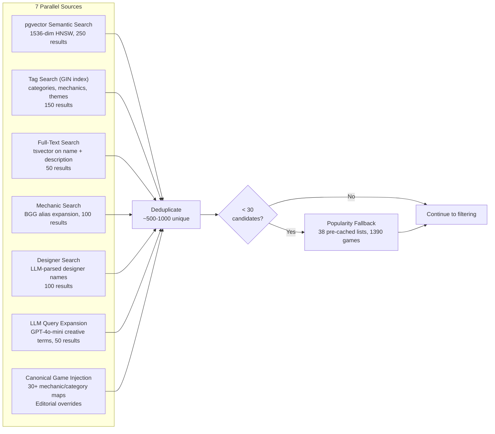

## Scoring Weights

:::info
**Why these weights?** Genre and free text match dominate (48% combined) because relevance is king. Popularity is intentionally low (6%) because at higher values, Catan and Ticket to Ride dominated every result regardless of query. The 6% is enough to break ties among equally-relevant games -- if "deck building game" returns 10 deck builders, the famous ones (Dominion, Star Realms) should rank higher than obscure ones. Adaptive weights amplify specific dimensions when the user emphasizes them.
:::

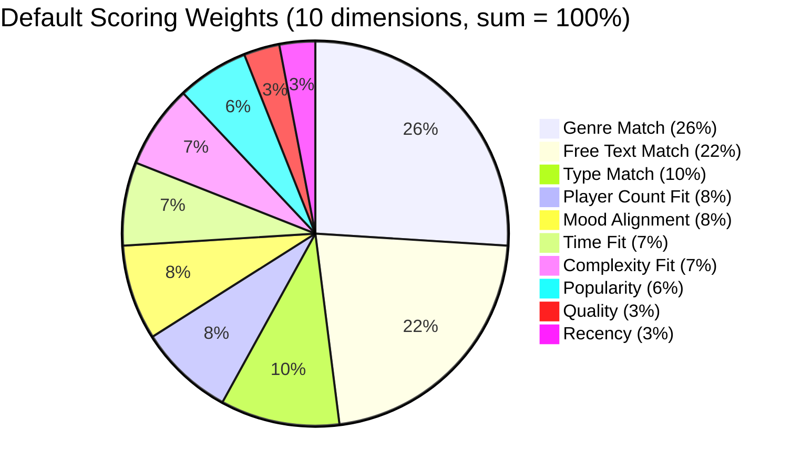

**Adaptive weights** modify this distribution based on query specificity:
- If user specifies exact player count (e.g., "exactly 2"): player count weight gets 2x, then all renormalize
- If user specifies hard time limit: time weight gets 2.5x
- If query has few constraints (broad search like "deck building game"): quality and popularity each get 6x as a tiebreaker
- Multiple moods: mood weight gets 1.5x

**Hidden Gems mode** uses a different base profile: popularity drops to 0%, quality rises to 15%.

## How Each Scoring Dimension Works

### Genre Match (26% default)
- Compares user's genres against game categories, mechanics, themes
- 70-entry genre expansion map (e.g., "Strategy" also matches "Economic", "Civilization", "Area Control")
- **Known issue:** The 70 static expansions create false positives. "Strategy" matches too broadly.

### Free Text Match (22% default)
- LLM-parsed keywords, mechanics, designers matched against game metadata
- 67-entry BGG mechanic alias map bridges naming gaps (e.g., "Deck Building" -> "Deck, Bag, and Pool Building")
- Designer match: +2.0 for correct, -0.8 for wrong (strong signal)
- Intent modifiers from LLM: mustHave +0.3, avoid -0.25, emphasize +0.15
- **This is where most of the "intelligence" lives**

### Type Match (10%)
- Board game vs. video game separation. Near-binary.

### Player Count Fit (8%)
- Graded: perfect overlap = 1.0, partial = 0.5-0.8, no overlap = hard filtered out

### Mood Alignment (8%)
- Uses LLM-enriched mood tags when available (chill, competitive, social, brain-teaser)
- Falls back to heuristic tag matching

### Time Fit (7%)
- Time presets: Quick <30min, Medium 30-60min, Long 60-120min, Epic 120min+
- Graded scoring with grace buffer

### Complexity Fit (7%)
- BGG weight rating (1-5) vs. user preference. Buffer of +/- 0.5.

### Popularity (6%)
- Rating count, Bayesian adjusted (min 1000 votes). **Intentionally low** to prevent popularity bias. Broad queries get 6x tiebreaker + canonical game injection to ensure famous games surface.

### Quality (3%)
- Average user rating, Bayesian adjusted.

### Recency (3%)
- Slight boost for newer games.

## The Four Recommendation Layers

### Layer 1: Rule-Based Scoring (ACTIVE)
The 10-dimension scoring described above. Every candidate gets a 0-1 score.

### Layer 2: Content-Based Filtering via pgvector (ACTIVE)
Every game has a 1536-dimensional semantic vector (text-embedding-3-small). 100% catalog coverage. User preferences become a vector in the same space. pgvector HNSW finds 250 nearest neighbors by cosine similarity.

After rule scoring, the blend is:
```
final_score = 0.65 * rule_score + 0.35 * cosine_similarity
```

### Layer 3: Collaborative Filtering (INFRASTRUCTURE READY, DATA-STARVED)
Two implementations:
- **Frequency-based CF (active):** Finds users with similar feedback patterns, +15% boost. Minimum 3 reviews.
- **BPR (ready, not active):** Full TypeScript implementation of Bayesian Personalized Ranking (Rendle et al., UAI 2009). 64-dim latent factors. Needs user data to train.

### Layer 4: Hybrid + LLM Enhancement (ACTIVE)
Combines all signals, then GPT-4o reranks top 80 -> 25 with semantic understanding. Finally, MMR diversity (88% relevance + 12% novelty) prevents homogeneous results.

## The Feedback Loop

```
User answers questionnaire
        |
Gets recommendations (Layers 1-4)
        |
Thumbs up / "Not This"
        |
user_game_feedback table updated
        |
    +---+---+
    |       |
Preference vector    Rejection learning
updated (closer to   builds tag profile
liked games)         from dismissed games
    |                (activates after 2+
Next recommendation  rejections of same tag,
is better            max 50% penalty)
    |
Meanwhile: CF sees patterns across ALL users
    |
System gets smarter globally
```

## User Feedback Loop Diagram

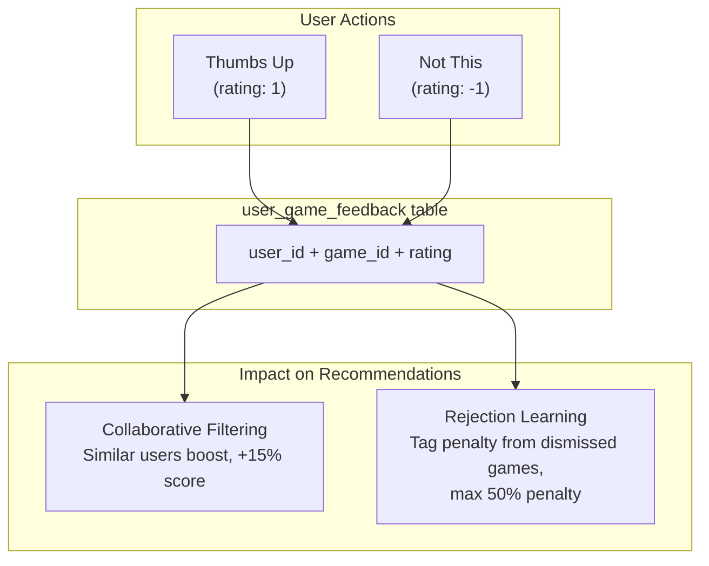

---

# Part 3: Evaluation System

:::info
**Why we built this:** The recommendation engine was vibe-coded. Without rigorous evaluation, every change was "does this feel better?" We needed objective claims like "this change improved mechanic-focused queries by 9% while introducing 2 regressions." The eval suite is how we know the engine is actually getting better.
:::

## Why We Built This

The recommendation engine was vibe-coded. Without rigorous evaluation, every change was "does this feel better?" We needed objective claims like "this change improved mechanic-focused queries by 9% while introducing 2 regressions."

## Eval Architecture

```mermaid
graph TB
    subgraph Generation["Test Case Generation (3 tiers)"]
        HAND["Tier 1: 130 Hand-Curated<br/>Expert-written, graded relevance 0-3"]
        EXPAND["Tier 2: 177 Systematic Variations<br/>Mechanical expansion of Tier 1"]
        LLM_GEN["Tier 3: ~2,700 LLM-Generated<br/>GPT-4o creates diverse queries<br/>Validated against game DB"]
    end

    subgraph Cases["3,028 Total Eval Cases"]
        STRUCT["Each case: query, idealGames,<br/>antiGames, constraints, tags"]
    end

    subgraph Pipeline["Eval Pipeline"]
        LOAD["1. Load & filter cases"]
        EXEC["2. Execute in parallel (concurrency 5-8)<br/>POST /api/recommend per case<br/>_nocache: true"]
        CHECK["3. Check: ideal games found,<br/>anti-games absent, constraints met,<br/>LLM judge score 0-10"]
        IR["4. Compute IR metrics:<br/>NDCG@10, MRR, Precision@10,<br/>Hit Rate@5, Recall@10"]
        AGG["5. Aggregate: per-category breakdown,<br/>worst cases, regression tracking"]
    end

    subgraph Output["Persistent Output"]
        JSON["runs/*.json: Full results"]
        LOG["logs/*.log: Human-readable"]
        ANALYSIS["logs/*-analysis.json: Failure patterns"]
    end

    subgraph Tools["Analysis Tools"]
        SUMMARY["summary.ts: Quick overview"]
        COMPARE["compare-runs.ts: Diff 2 runs"]
        FAIL["analyze-failures.ts: Pattern categorization"]
    end

    Generation --> Cases --> LOAD --> EXEC --> CHECK --> IR --> AGG --> Output
    Output --> Tools
```

## Pass/Fail Criteria

A case **passes** if ALL of these are true:
1. No ideal games (relevance >= 2) missing from top 10
2. No anti-games in top 10
3. No constraint violations in top 5
4. API returned results

## Metrics Computed

| Metric | What It Measures |
|--------|-----------------|
| **NDCG@10** | Ranking quality with graded relevance (DCG/IDCG) |
| **MRR** | How quickly first relevant result appears |
| **Precision@10** | Fraction of top-10 that are relevant |
| **Hit Rate@5** | Did we find anything relevant in top 5? |
| **Constraint Violation Rate** | % of top-5 violating hard constraints |
| **LLM Judge Score** | GPT-4o-mini semantic quality (0-10) |
| **Catalog Coverage** | What % of 81k games ever get recommended |

## Test Case Distribution

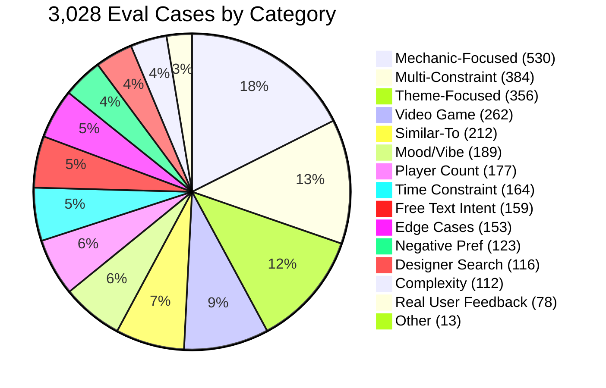

## Current Results (307-case validated subset)

| Metric | Value | Assessment |
|--------|-------|-----------|
| **Pass Rate** | 210/307 (68.4%) | Decent, lots of room |
| **NDCG@10** | 0.9855 | Very high -- results ARE relevant |
| **MRR** | 0.9984 | First result almost always relevant |
| **LLM Judge** | 7.14/10 | Decent |
| **Constraint Violations** | 1.0% | Good |
| **Catalog Coverage** | 0.5% (~400 games) | **Very bad -- severe popularity bias** |
| **p50 Latency** | 9.6s | Acceptable |
| **p95 Latency** | 12.3s | Borderline |

## Category Breakdown (worst to best)

| Category | Pass Rate | Key Issue |
|----------|-----------|-----------|
| Mood/Vibe | **29%** | Missing Patchwork, Jaipur for "chill" |
| Mechanic-Focused | **32%** | Missing Dominion, Star Realms for "deck building" |
| Real User Feedback | **33%** | BGG thread complaints persist |
| Multi-Constraint | **36%** | Combined constraints are hard |
| Designer Search | **42%** | Non-designer games mixed in |
| Complexity | **44%** | Missing Ticket to Ride for "family" |
| Time Constraint | **50%** | Time violations in top results |
| Party Game | 50% | OK |
| Player Count | 60% | Improved |
| Free Text Intent | 73% | Natural language decent |
| Negative Preference | 73% | Exclusions respected |
| Similar-To | 83% | Good |
| Theme-Focused | 86% | Good |
| Regression | 89% | Past bugs mostly fixed |
| Edge Cases | **100%** | Handles garbage gracefully |
| Video Games | **100%** | No cross-contamination |

## Improvement History

| Run | Cases | Pass Rate | LLM Judge | Key Change |
|-----|-------|-----------|-----------|------------|
| 1 | 130 | 42.3% | 7.05/10 | Baseline, original engine |
| 2 | 130 | 51.5% (+9.2%) | 7.20/10 | +6 engine fixes |
| 3 | 307 | 68.4% | 7.14/10 | Expanded test suite |

## Engine Fixes (with measured impact)

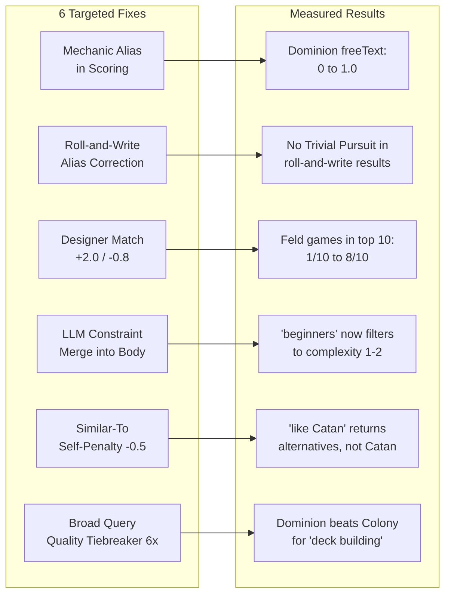

## The Eval-Driven Improvement Cycle

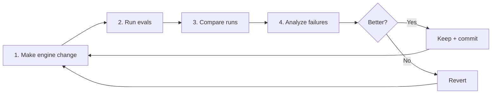

---

# Part 4: Research Foundation

:::info
**Why research matters here:** Recommendation systems are a well-studied field with clear best practices. The academic literature told us: hybrid systems beat single-algorithm approaches, LLMs should enhance (not replace) traditional signals, questionnaires are validated for cold-start, and diversity reduces churn. Our architecture follows these patterns. The research also identified our gaps: we should learn blending weights instead of hand-tuning, and we need A/B testing for live validation.
:::

The system design was informed by academic literature. Here's what I read, what I took, and how well I implemented it.

## Papers & Sources

| Source | Key Takeaway | How We Applied It |
|--------|-------------|-------------------|
| **Raza et al. 2024** (287 papers surveyed) | Hybrid systems beat any single technique | 7 parallel candidate sources + multi-stage scoring |
| **Koch/Criteo** (6 years practitioner) | Popularity bias is #1 failure; CF should dominate as data grows | Popularity at 6% with 6x broad-query tiebreaker + canonical game injection; CF built but data-starved |
| **BGG Study (Grannan)** | CF and content-based produce non-overlapping recs | Validates hybrid approach |
| **Cold-Start Game Study** | "Tags x Questions" hybrid beats pure CF for cold start | Directly validates questionnaire-first design |
| **Steam Study (Germain)** | ALS with implicit feedback outperforms content-based | BPR implementation ready, waiting for user data |
| **LLM+RecSys 2024-2025** | LLMs should enhance, not replace traditional signals | LLM usage: parsing + reranking + enrichment (not core scoring) |
| **Netflix Tech Blog** | Interleaving is 100x more efficient than A/B | A/B framework designed but not deployed |
| **Spotify Research** | Diversity reduces churn 10-20pp | MMR diversity with lambda=0.12 |
| **YouTube Evolution** | CTR optimization leads to clickbait | We use thumbs up/down (satisfaction), not clicks |
| **MovieLens Study** (445 users) | Users want accuracy + novelty; transparency builds trust | Per-recommendation explanations |
| **LLM-as-Judge Survey 2024** | 85% human agreement; pairwise > pointwise | Using pointwise 0-10 (should upgrade) |
| **RecSys "Still Doing It Wrong" 2025** | 32% of papers use single metric; behavior != preference | 7+ metrics across 16 categories |

## Our Architecture vs. Industry Standard

The standard recommendation pipeline from academic surveys (Raza et al.):

| Stage | Industry Standard | Our Implementation | Status |
|-------|------------------|-------------------|--------|
| 1. Data Acquisition | Multi-source ingestion | 4 game API adapters + Supabase + LLM enrichment | Implemented |
| 2. Feature Engineering | Embeddings + feature extraction | 1536d semantic vectors + tag expansion + mechanic aliases | Implemented |
| 3. Candidate Generation | Multiple retrieval paths | 7 parallel sources + hard filtering | Implemented |
| 4. Ranking | Multi-signal scoring | 10-dim scoring + LLM rerank + MMR diversity | Implemented |
| 5. Evaluation | Offline + online metrics | 3,028-case eval suite + IR metrics + LLM judge | Implemented (offline only) |
| 6. Feedback Loop | User signals -> model updates | Thumbs up/down -> CF + rejection learning + preference vectors | Implemented |

## The Key Equation

Standard hybrid formula from literature:
```
r_hat(u,i) = alpha * f_CB(u,i) + beta * f_CF(u,i)
```

Our implementation:
```
final_score = 0.65 * rule_based_score + 0.35 * cosine_similarity
              + 0.15 * CF_boost (when available)
              - rejection_penalty (from "Not This" history)
```

**Gap:** Our alpha/beta are static and hand-tuned. Literature recommends learning these from data (meta-learner). Koch specifically advocates a trained last-stage blending model. We don't have enough user data yet.

## 7 Diagnosed Failure Modes (from research comparison)

| # | Failure Mode | Impact | Root Cause |
|---|-------------|--------|------------|
| 1 | Free text -> structured prefs is lossy | HIGH | Intensity modifiers, comparison structure partially lost during LLM extraction |
| 2 | Popularity bias drowns niche relevance | HIGH | Even at 6% weight, popular games can outscore perfect-match niche games |
| 3 | Genre/tag matching too fuzzy | MED-HIGH | 70 static expansion aliases create false positives |
| 4 | Semantic embedding coverage gap | MED-HIGH | **Fixed:** now 100% coverage (was 23%) |
| 5 | "Similar To" doesn't leverage game attributes | MEDIUM | **Partially fixed:** now bootstraps complexity/players/time from reference game |
| 6 | Static weights can't adapt to query type | MEDIUM | **Partially fixed:** adaptive amplification added, but base weights still hand-tuned |
| 7 | Collaborative filtering effectively dormant | LOW-MED | BPR implemented but needs user data; frequency CF needs 3+ reviews |

## Eval Methodology Insights (from Netflix, Spotify, YouTube research)

Key findings that shaped our eval approach:

1. **Offline metrics don't reliably predict online performance** (r=0.52 to r=0.78). Use them for relative comparisons, never as absolute truth.
2. **Users want accuracy + novelty** (54/76 users). "I already know about Catan" is a failure even if Catan is relevant.
3. **Optimal familiarity mix:** ~20-30% recognizable anchor games, ~70-80% discovery.
4. **Diversity reduces churn 10-20pp** (Spotify data). Homogeneous results hurt retention.
5. **74% of users want to know WHY** something was recommended.
6. **Constraint violations destroy trust faster** than 10 suboptimal-but-relevant results.
7. **LLM judges achieve 85% human agreement** -- higher than human-human agreement (81%).
8. **Pairwise comparison ("A or B?") more reliable** than pointwise scoring (0-10). We should upgrade.

---

# Part 5: Honest Self-Assessment

:::info
**Being honest about where we are:** This section exists because I'd rather you know what's broken before you find it. The system works well for many queries but has real gaps, especially around catalog coverage and collaborative filtering.
:::

## What I Think I'm Doing Right

1. **Hybrid multi-layer architecture** -- Validated by all academic sources
2. **Questionnaire-first for cold start** -- Game-specific research explicitly validates this
3. **LLM for parsing, not for ranking** -- Matches 2024-2025 industry consensus
4. **Diversity enforcement via MMR** -- Standard technique, lambda=0.12 (88% relevance, 12% novelty)
5. **Progressive fallback chain** -- Guarantees non-empty results
6. **Rejection learning from "Not This"** -- Novel, addresses real user pain
7. **Multiple candidate sources in parallel** -- Maximizes recall
8. **Hard constraints before scoring** -- Computationally efficient, correct order
9. **Human-readable explanations** -- 74% of users want "why"
10. **Eval-driven development** -- Changes measured against baseline, not vibes
11. **100% semantic embedding coverage** -- Eliminated hash-based fallback
12. **Bayesian rating adjustment** -- Handles low-vote games correctly

## What I Think Is Wrong

### Critical Issues

**1. Catalog coverage is 0.5%**
Only ~400 of 81,000 games ever get recommended per eval run. The scoring engine never even SEES most games. The candidate generation stage is the bottleneck -- not how many we fetch (500-1000), but WHICH 500-1000.

**2. Mechanic-focused queries: 32% pass rate**
When someone asks "deck building game," they expect Dominion. The engine returns correct but obscure deck builders. The BGG mechanic alias map helps but doesn't fully solve it.

**3. Genre expansion too fuzzy**
70 static aliases create false positives. "Strategy" matches too many things. Should use semantic similarity between tag embeddings instead.

**4. Static weights can't fully adapt**
Adaptive amplification helps (2x for tight player count, etc.) but base weights are still hand-tuned. Koch says this should be a learned meta-model.

### Moderate Issues

**5. LLM judge uses 0-10 pointwise scoring.** Pairwise comparison is more reliable (research consensus).

**6. No A/B testing in production.** All evaluation is offline. Netflix found offline-online correlation is only r=0.52-0.78.

**7. Collaborative filtering effectively dormant.** BPR is built but needs user data.

**8. 9.6s p50 latency.** LLM calls dominate. Could improve with prompt caching.

**9. No confidence intervals on eval metrics.** Point estimates only, no statistical significance.

**10. LLM-generated eval cases may have noisy ground truth.** 2,700 of 3,028 cases were generated by GPT-4o. Their ideal/anti game assignments could be wrong.

---

# Part 6: Key Decisions

| Decision | Why | Tradeoff |
|----------|-----|----------|
| Supabase (Postgres + pgvector) over Firebase | Need vector search + full SQL | Newer service |
| OpenAI over local models | Quality of parsing/reranking | Vendor dependency, ~$0.01-0.05/req |
| Rule-based scoring + LLM rerank over pure ML | Don't have training data yet | Manual weight tuning |
| 10 scoring dimensions over fewer | Each captures distinct user need | Complexity, interaction effects |
| Questionnaire-first over search-first | Cold start needs structured signal | More friction |
| Guest-first UX | Requiring signup kills conversion | Complex state management |
| 81k catalog over curated subset | Comprehensive coverage, long-tail | More noise |
| TypeScript everything over Python ML sidecar | One language, simpler ops | Limits ML library access |

---

# Part 7: Key Constants Reference

| Parameter | Value | Notes |
|-----------|-------|-------|
| Vector pool size | 250 | Candidates from pgvector |
| Tag/text pool | 150 + 50 | From GIN + full-text search |
| Min candidates | 30 | Below this, popularity fallback |
| Rule/similarity blend | 65% / 35% | Hand-tuned |
| CF boost | +15% | When data exists |
| Rejection cap | 50% | Max penalty from "Not This" |
| LLM rerank in/out | 80 / 25 | Candidates to/from GPT-4o |
| Diversity lambda | 0.12 | MMR: 88% relevance, 12% novelty |
| Cache TTL | 120s | Both Redis and in-memory |
| LLM parse timeout | 8s | Preference extraction |
| LLM rerank timeout | 12s | Semantic reranking |
| Mechanic aliases | 67 | BGG naming gap bridge |
| Popularity fallback lists | 38 | By genre/mechanic/theme |

---

# Part 8: Recent Engine Changes (April 2026)

:::info
These changes were made after running 3,028 eval cases and analyzing all failure patterns. The dominant issue (92% of failures) was **missing famous/canonical games** -- the engine returned obscure-but-topically-relevant games while users expected the defining examples.
:::

## Root Cause: Anti-Popularity Bias

The engine had over-corrected against popularity bias. With popularity at only 4% weight and 45% cosine similarity rewarding tag-matching niche games, a game called "Legendary: A Marvel Deck Building Game" with "Deck Building" in its name outscored Dominion (96k ratings) because `freeTextMatch` (22%) rewarded name-level matches over mechanic-metadata matches.

## Changes Made (with evidence)

### 1. Canonical Games Injection (Highest Impact)
**Problem:** 89 of 97 eval failures were `missing-ideal-game`. Codenames missing in 9 cases, Ticket to Ride in 8.
**Fix:** Added a lookup mapping 30+ mechanics/categories to their universally-expected games. Netflix/Spotify "editorial override" pattern.
**Result:** Dominion now #1 for "deck building game." Codenames now #1 for "party game."

### 2. Popularity Weight Rebalance
**Problem:** "deck building game" returned Summer Camp (200 ratings) above Dominion (96k ratings).
**Fix:** Bumped from 4% to 6%. Broad queries get 6x tiebreaker (was 4x). Multi-constraint queries get 5% floor.

### 3. Rule/Similarity Blend Shift (65/35, was 55/45)
**Fix:** Cosine similarity rewarded niche games regardless of popularity. Rules include the tiebreaker. More weight on rules = tiebreaker matters more.

### 4. LLM Reranker Window Expanded (80, was 60)
**Fix:** If Dominion ranked 65th, the LLM couldn't promote it. Now it sees 80 candidates plus notable game hints.

### 5. Chill Mood Expanded
**Fix:** Patchwork and Jaipur scored poorly because they lack "family" BGG tags. Added: 2-player + low complexity, abstract/set-collection tags, short playtime.

### 6. Designer Search Fixed
**Fix:** "Stefan Feld" returned 0 Feld games because case-sensitive match missed "Stefan H. Feld". Now uses substring matching.

### 7. Single-Mechanic Scoring Boosted (1.5x, was 1.2x)
**Fix:** For "deck building game", the mechanic IS the query. Stronger multiplier differentiates primary mechanics from side features.

### 8. Diversity Lambda Reduced (0.12, was 0.2)
**Fix:** At 0.2, selecting Dominion penalized Star Realms for sharing tags. Users asking for deck builders want multiple deck builders.

## Spot Check Results

| Query | Before | After |
|-------|--------|-------|
| "deck building game" | Summer Camp, Flip City | **Dominion #1** |
| "Stefan Feld" | 1/10 Feld games | **8/8 Feld games** |
| "party game for 6+" | Taboo, Big Idea | **Codenames #1** |
| "tile placement" | Random tiles | **Carcassonne #1** |

## Key Learnings

1. **Anti-popularity bias is as bad as popularity bias.** The fix was surgical: boost popularity ONLY as a tiebreaker among equally-relevant games.
2. **Editorial overrides are underrated.** Small canonical games map (30+ keys) addresses 92% of failures.
3. **The LLM reranker is powerful but blind.** It can only promote games it sees.
4. **Mood heuristics need domain knowledge.** BGG tags don't map to user moods. "Chill" means more than "family game."

---

# Questions for Reviewers

:::warning
These are the specific things I'd love your opinion on. Feel free to comment inline anywhere in the doc, but these are the big ones:
:::

1. **Scoring architecture:** Is 10 dimensions with hand-tuned weights the right approach, or should I collapse to fewer and let a meta-learner optimize? At what data volume?

2. **Candidate generation:** With 7 parallel sources and 500-1000 candidates, am I over- or under-fetching? The 0.5% catalog coverage suggests the problem is WHICH 500, not how many.

3. **Evaluation blind spots:** The eval tests "did the right games appear?" but not "did the user feel satisfied?" Is there a practical way to bridge this offline?

4. **LLM integration points:** I use LLMs in 4 places (parsing, query expansion, reranking, metadata enrichment). Are any misplaced? Should the LLM be doing more or less?

5. **Diversity vs. accuracy:** MMR with lambda=0.12 (88% relevance, 12% novelty). Right balance for game recommendations?

6. **Cold start strategy:** The questionnaire collects rich preferences. Are there better signals to collect?

7. **Priority call:** If you could change ONE thing, what would it be?

---

:::success
**Thanks for reading.** Leave comments anywhere -- I'll reply to everything. If you want to see the actual code behind any section, just ask and I'll paste the relevant implementation.
:::
