# boredgame.lol Technical Review Packet

**For:** External technical reviewers
**Date:** April 2026
**Author:** Dan (solo developer, vibe-coded with Claude)
**Site:** boredgame.lol -- a smart game recommendation engine

---

## What This Is

boredgame.lol recommends board games and video games based on natural language input, structured preferences, and learned user behavior. A user types "a chill 2-player game for date night, nothing too complex" and gets back ranked, explained recommendations from a catalog of 81,000 games.

The entire system was vibe-coded by one person with AI assistance. This packet exists because I want smart people to tell me what's wrong, what's good, and what I should prioritize next. I'm not an ML engineer. I read a bunch of papers and implemented what made sense. There are certainly mistakes.

**What I want feedback on:**
1. Is the recommendation architecture sound, or are there fundamental design flaws?
2. Is the evaluation methodology measuring the right things? Are there blind spots?
3. Are the scoring weights and pipeline stages ordered correctly?
4. What would you change first if you inherited this codebase?
5. Are there obvious academic/industry best practices I'm violating?

---

## Table of Contents

1. [Tech Stack](#tech-stack)
2. [System Architecture (End-to-End)](#system-architecture)
3. [Recommendation Pipeline (Deep Dive)](#recommendation-pipeline)
4. [Scoring System (10 Dimensions)](#scoring-system)
5. [Data Sources & Adapter Pattern](#data-sources)
6. [Evaluation System](#evaluation-system)
7. [Eval Results & Known Issues](#eval-results)
8. [Research Foundation](#research-foundation)
9. [What I Think I'm Doing Right](#what-i-think-im-doing-right)
10. [What I Think Is Wrong](#what-i-think-is-wrong)
11. [Key Architectural Decisions](#key-decisions)
12. [File Reference](#file-reference)

---

## Tech Stack

| Layer | Technology | Notes |
|-------|-----------|-------|
| Framework | Next.js 16 (App Router) | Server components, API routes, SSR |
| UI | React 19 + MUI 7 | Material Design components |
| Language | TypeScript 5 | Strict mode |
| Auth | Supabase Auth | Email/password + Google OAuth |
| Database | Supabase PostgreSQL | 81k games, user profiles, feedback |
| Vector Search | pgvector (HNSW) | 768-dim hash + 1536-dim semantic embeddings |
| AI | OpenAI GPT-4o / GPT-4o-mini | Parsing, reranking, query expansion, metadata enrichment |
| Embeddings | text-embedding-3-small | 1536-dim semantic vectors, 100% catalog coverage |
| Cache | Upstash Redis + in-memory LRU | 2 min TTL, 50-entry in-memory |
| Testing | Vitest + React Testing Library | Unit + integration tests |
| Eval | Custom TypeScript framework | 3,028 cases, IR metrics, LLM-as-judge |
| Deployment | Vercel | Serverless functions |

---

## System Architecture

### End-to-End Overview

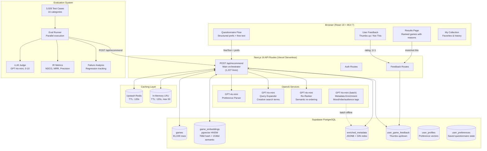

### Request Lifecycle (Latency Budget)

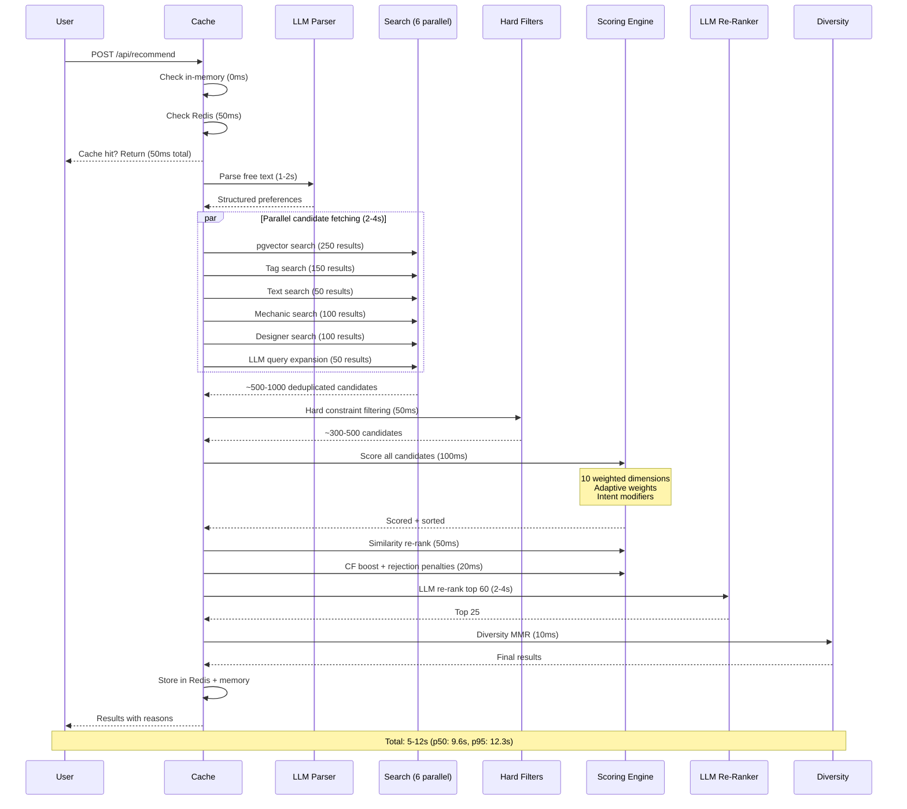

---

## Recommendation Pipeline

This is the core of the system. Every recommendation request flows through 9 stages.

### Stage-by-Stage Pipeline

```mermaid
flowchart TD
    INPUT["User Input<br/>'a fun anime board game for 4 players'"]

    subgraph S1["Stage 1: LLM Preference Parsing"]
        
        PARSE["GPT-4o-mini extracts:"]
        OUT["Structured output: genres, mechanics,<br/>moods, complexity, playerCount,<br/>designers, similarTo, intentModifiers"]
    end

    subgraph S2["Stage 2: Similar-To Bootstrapping"]
        
        FETCH["Fetch referenced game's full profile"]
        INHERIT["Inherit complexity, player count,<br/>time range, boost core mechanics 1.5x"]
    end

    subgraph S3["Stage 3: Cache Check"]
        KEY["Cache key = hash of<br/>freeText + parsed genres + all prefs"]
        HIT{Hit?}
    end

    subgraph S4["Stage 4: Candidate Generation (parallel)"]
        VEC["pgvector Semantic<br/>250 candidates"]
        TAG["GIN Index Tags<br/>150 candidates"]
        TXT["Full-Text Search<br/>50 candidates"]
        MECH["Mechanic Search<br/>100 candidates"]
        DES["Designer Search<br/>100 candidates"]
        EXP["LLM Query Expand<br/>50 candidates"]
        POP["Popularity Fallback<br/>(only if < 30 total)"]
    end

    subgraph S5["Stage 5: Hard Constraint Filtering"]
        FILT["Filter by: player count, time,<br/>complexity, game type,<br/>expansion removal"]
    end

    subgraph S6["Stage 6: Adaptive Weight Computation"]
        AW["Amplify weights by query specificity<br/>then renormalize to 100%"]
    end

    subgraph S7["Stage 7: Rule-Based Scoring (10 dimensions)"]
        SCORE["10 weighted dimensions<br/>Genre 26%, FreeText 22%, Type 10%<br/>Players 8%, Mood 8%, Time 7%<br/>Complexity 7%, Pop 6%, Quality 3%<br/>Recency 3% + intent modifiers"]
    end

    subgraph S8["Stage 8: Multi-Signal Re-Ranking"]
        SIM["Similarity Re-Rank<br/>55% rule + 45% cosine similarity"]
        CF["Collaborative Filtering<br/>+15% boost for CF signals"]
        REJ["Rejection Learning<br/>Penalty from 'Not This' history"]
        LLM_RR["LLM Re-Rank<br/>GPT-4o-mini: 60 in, 25 out"]
    end

    subgraph S9["Stage 9: Diversity Enforcement"]
        DIV["Maximal Marginal Relevance<br/>80% relevance + 20% novelty<br/>Applied to top 30"]
    end

    OUTPUT["Final Output<br/>Up to 100 games with<br/>scores, reasons, breakdowns"]

    INPUT --> S1 --> S2 --> S3
    S3 -->|Miss| S4
    S3 -->|Hit| OUTPUT
    S4 --> S5 --> S6 --> S7 --> S8 --> S9 --> OUTPUT

    style S1 fill:#e3f2fd
    style S4 fill:#fff3e0
    style S7 fill:#e8f5e9
    style S8 fill:#fce4ec
    style S9 fill:#f3e5f5
```

### Candidate Generation Detail

The system fetches candidates from 6 parallel sources, then deduplicates. This is the "recall" stage -- the goal is to cast a wide net so the scoring engine has good candidates to rank.

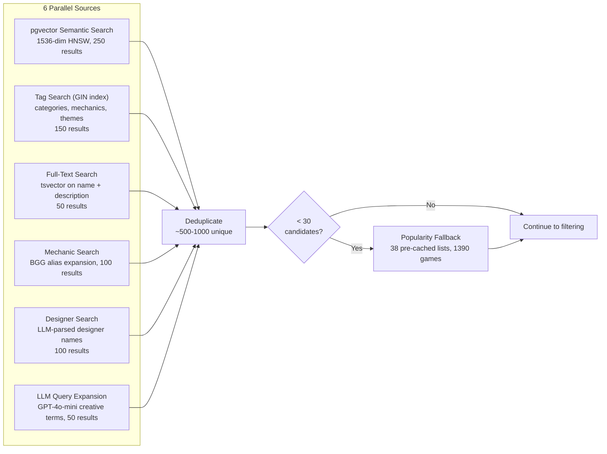

### Scoring Weight Distribution

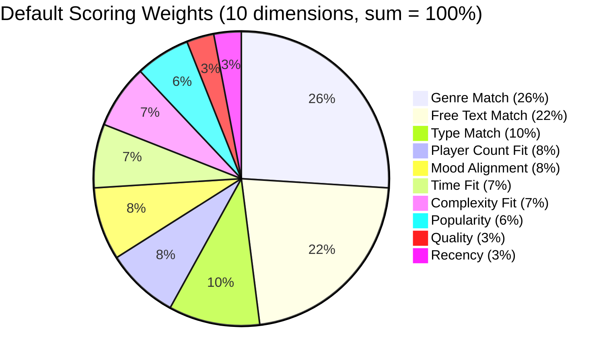

**Adaptive weights** modify this distribution based on query specificity:
- If user specifies exact player count (e.g., "exactly 2"): player count weight gets 2x, then all renormalize
- If user specifies hard time limit: time weight gets 2.5x
- If query has few constraints (broad search): quality and popularity each get 4x (tiebreaker among equally relevant games)

**Hidden Gems mode** uses a different profile: popularity drops to 0%, quality rises to 15%.

---

## Scoring System

Each of the 10 scoring dimensions produces a 0.0 to 1.0 score for each candidate game. Here's how each works:

### Genre Match (26% default weight)
- Compares user's selected genres against game's categories, mechanics, and themes
- Uses a 70-entry genre expansion map (e.g., "Strategy" also matches "Economic", "Civilization", "Area Control")
- Substring matching with alias awareness
- Score: proportion of user genres that match * 0.6 + 0.4 floor
- **Known issue:** The 70 static expansions create false positives. "Strategy" matches too broadly.

### Free Text Match (22% default weight)
- LLM-parsed keywords, mechanics, designers, and similar-to references matched against game metadata
- Uses BGG mechanic alias map (67 entries) to bridge naming gaps (e.g., "Deck Building" -> "Deck, Bag, and Pool Building")
- Designer match: +2.0 for correct, -0.8 for wrong (strong signal)
- Mechanic match: +1.2 for match, -0.3 for miss when mechanic was specifically requested
- Intent modifiers: mustHave +0.3 bonus, avoid -0.25 penalty
- **This is where most of the "intelligence" lives**

### Type Match (10%)
- Board game vs. video game separation
- Near-binary: correct type gets ~1.0, wrong type gets ~0.0

### Player Count Fit (8%)
- Checks if game supports the requested player count
- Graded: perfect overlap = 1.0, partial overlap = 0.5-0.8, no overlap = 0.0 (hard filtered)

### Mood Alignment (8%)
- Matches user's mood preferences (chill, competitive, social, brain-teaser, etc.)
- Uses LLM-enriched mood tags when available (higher confidence)
- Falls back to heuristic tag matching (maps moods to BGG categories/mechanics)

### Time Fit (7%)
- Compares game's play time against user's time preference
- Uses time presets (Quick <30min, Medium 30-60min, Long 60-120min, Epic 120min+)
- Graded scoring with grace buffer

### Complexity Fit (7%)
- BGG weight rating (1-5 scale) compared to user preference
- Buffer of +/- 0.5 before penalty starts

### Popularity (6%)
- Based on BGG/IGDB rating count
- Uses Bayesian adjustment (minimum 1000 votes for confidence)
- Intentionally low weight to prevent popularity bias dominating

### Quality (3%)
- Based on average user rating (BGG/IGDB)
- Bayesian-adjusted to handle games with few ratings

### Recency (3%)
- Slight boost for newer games
- Prevents the catalog from feeling stale

---

## Data Sources

### Adapter Pattern

Every external game source implements the `GameAdapter` interface and normalizes to a unified `Game` type.

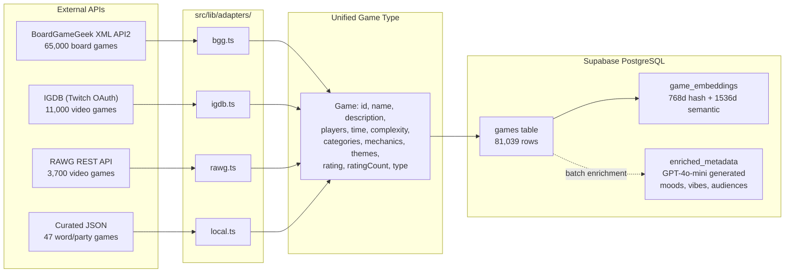

### Game Count by Source

| Source | Games | Type | Notes |
|--------|-------|------|-------|
| BoardGameGeek | ~65,000 | Board games | XML API, rate limited, mirrored locally |
| IGDB | ~11,000 | Video games | Twitch OAuth, rich metadata |
| RAWG | ~3,700 | Video games | REST API, good for supplementary data |
| Curated JSON | 47 | Word/party games | Hand-maintained for gaps in APIs |
| **Total** | **~81,000** | Mixed | Deduplicated across sources |

---

## Evaluation System

### Why We Built This

The recommendation engine was vibe-coded. Without rigorous evaluation, every change was "does this feel better?" We needed a way to make objective claims like "this change improved mechanic-focused queries by 9% while introducing 2 regressions."

### Architecture

```mermaid
graph TB
    subgraph Generation["Test Case Generation (3 tiers)"]
        HAND["Tier 1: 130 Hand-Curated<br/>Expert-written, graded relevance 0-3<br/>Covers all 16 categories"]
        EXPAND["Tier 2: 177 Systematic Variations<br/>Mechanical expansion of Tier 1<br/>Player count/time/complexity combos"]
        LLM_GEN["Tier 3: ~2,700 LLM-Generated<br/>GPT-4o creates diverse queries<br/>Validated against game DB"]
    end

    subgraph Cases["3,028 Total Eval Cases"]
        STRUCT["Each case: query, idealGames,<br/>antiGames, constraints, tags"]
    end

    subgraph Pipeline["Eval Pipeline"]
        LOAD["Load and filter cases"]
        EXEC["Execute in parallel<br/>POST /api/recommend per case"]
        CHECK["Check ideal games found,<br/>anti-games absent, constraints met"]
        IR["Compute IR metrics:<br/>NDCG, MRR, Precision, Hit Rate"]
        AGG["Aggregate per-category,<br/>worst cases, regressions"]
    end

    subgraph Output["Persistent Output"]
        JSON["evals/runs/*.json<br/>Full machine-readable results"]
        LOG["evals/logs/*.log<br/>Human-readable reports"]
        ANALYSIS["evals/logs/*-analysis.json<br/>Failure pattern categorization"]
    end

    subgraph Tools["Analysis Tools"]
        SUMMARY["summary.ts<br/>Quick overview of any run"]
        COMPARE["compare-runs.ts<br/>Side-by-side diff of 2 runs"]
        FAIL["analyze-failures.ts<br/>Categorize failure patterns"]
    end

    Generation --> Cases --> LOAD --> EXEC --> CHECK --> IR --> AGG --> Output
    Output --> Tools
```

### Pass/Fail Criteria

A case **passes** if ALL of these are true:
1. No ideal games (relevance >= 2) are missing from top 10
2. No anti-games appear in top 10
3. No constraint violations in top 5
4. API returned results (didn't crash)

### Metrics Computed

| Metric | What It Measures | Formula |
|--------|-----------------|---------|
| **NDCG@10** | Ranking quality with graded relevance | DCG / IDCG, where gains = 2^relevance - 1, discounts = 1/log2(rank+1) |
| **MRR** | How quickly first relevant result appears | 1/rank of first relevant result, averaged |
| **Precision@10** | Fraction of top-10 that are relevant | relevant_in_top10 / 10 |
| **Hit Rate@5** | Did we find anything relevant in top 5? | Binary, averaged across cases |
| **Constraint Violation Rate** | % of top-5 results violating hard constraints | violations / (cases * 5) |
| **LLM Judge Score** | Semantic quality assessment | GPT-4o-mini scores 0-10 per case |
| **Catalog Coverage** | What % of 81k games ever get recommended | unique_games / 81,039 |

### Test Case Distribution

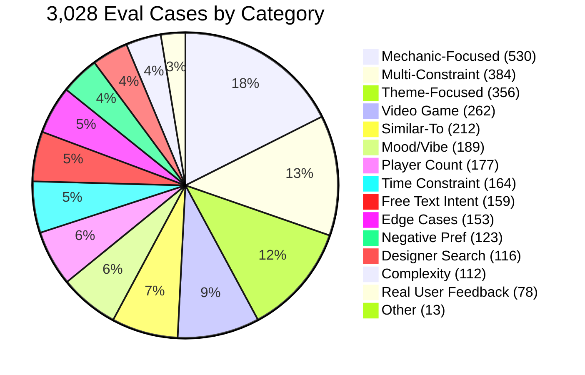

### The Eval-Driven Improvement Cycle

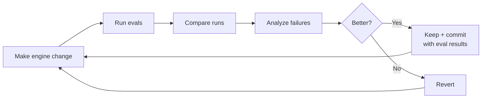

---

## Eval Results

### Latest Baseline (307 test cases, original engine)

| Metric | Value | Assessment |
|--------|-------|-----------|
| **Pass Rate** | 210/307 (68.4%) | Decent but lots of room |
| **NDCG@10** | 0.9855 | Very high -- results ARE relevant |
| **MRR** | 0.9984 | First result almost always relevant |
| **LLM Judge** | 7.14/10 | Decent |
| **Constraint Violations** | 1.0% | Good |
| **Catalog Coverage** | 0.5% (~400 games) | Very bad -- severe popularity bias |
| **p50 Latency** | 9.6s | Acceptable |
| **p95 Latency** | 12.3s | Borderline |

### Category Breakdown (worst to best)

| Category | Pass Rate | Key Issue |
|----------|-----------|-----------|
| Mood/Vibe | **29%** | Missing Patchwork, Jaipur for "chill" |
| Mechanic-Focused | **32%** | Missing Dominion, Star Realms for "deck building" |
| Real User Feedback | **33%** | BGG thread complaints persist |
| Multi-Constraint | **36%** | Combined constraints are hard |
| Designer Search | **42%** | Non-designer games mixed in |
| Complexity | **44%** | Missing Ticket to Ride for "family" |
| Time Constraint | **50%** | Time violations in top results |
| Party Game | 50% | OK |
| Player Count | 60% | Improved |
| Free Text Intent | 73% | Natural language decent |
| Negative Preference | 73% | Exclusions respected |
| Similar-To | 83% | Good |
| Theme-Focused | 86% | Good |
| Regression | 89% | Past bugs mostly fixed |
| Edge Cases | **100%** | Handles garbage gracefully |
| Video Games | **100%** | No cross-contamination |

### Improvement History

| Run | Cases | Pass Rate | LLM Judge | Key Change |
|-----|-------|-----------|-----------|------------|
| 1 | 130 | 42.3% | 7.05/10 | Baseline, original engine |
| 2 | 130 | 51.5% (+9.2%) | 7.20/10 | +6 engine fixes (mechanic alias, designer boost, constraint merge, tiebreaker) |
| 3 | 307 | 68.4% | 7.14/10 | Expanded test suite |

### Engine Fixes Applied (with measured impact)

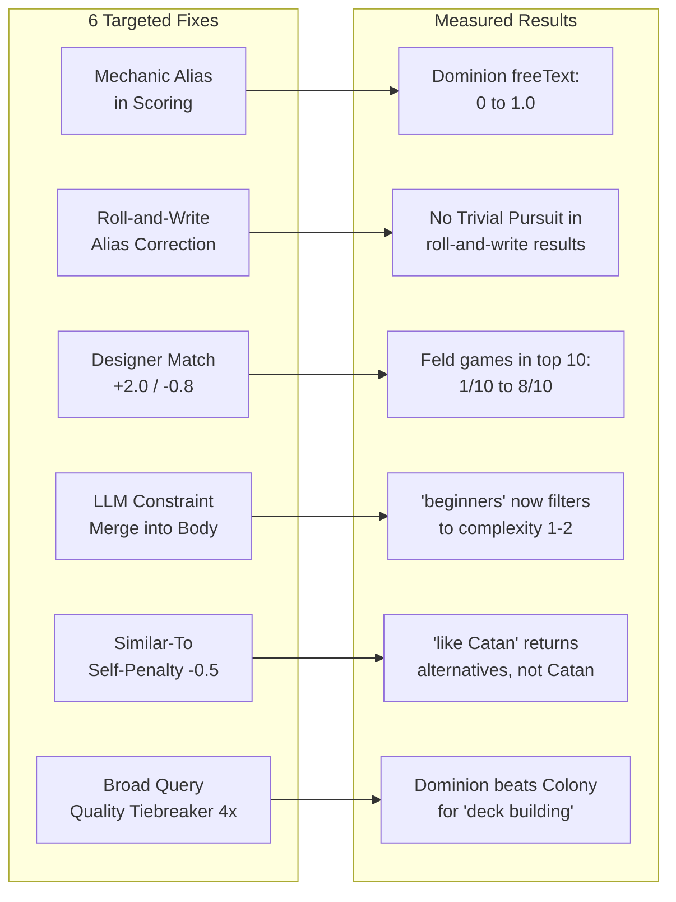

---

## Research Foundation

The system design was informed by academic literature. Here's what we read, what we took from it, and how well we implemented it.

### Papers & Sources Read

| Source | Key Takeaway | How We Applied It |
|--------|-------------|-------------------|
| Raza et al. 2024 (287 papers surveyed) | Hybrid systems beat any single technique | We use 6 parallel candidate sources + multi-stage scoring |
| Koch/Critio (6 years practitioner) | Popularity bias is the #1 failure mode; CF should dominate as data grows | Popularity at 6% with 6x broad-query tiebreaker + canonical game injection; CF infrastructure built but data-starved |
| Forrester 2023 | Production systems combine CF + content + deep learning + community | Matches our architecture |
| BGG Study (Grannan) | CF and content-based produce non-overlapping recommendations | Validates our hybrid approach |
| Cold-Start Game Study | "Tags x Questions" hybrid beats pure CF for cold start | Directly validates our questionnaire-first design |
| Steam Study (Germain) | ALS with implicit feedback outperforms content-based | BPR implementation ready, waiting for user data |
| LLM+RecSys Papers 2024-2025 | LLMs should enhance, not replace, traditional signals | Our LLM usage: parsing + reranking + enrichment (not core scoring) |
| Netflix Tech Blog | Interleaving is 100x more sample-efficient than A/B testing | A/B framework designed but not deployed |
| Spotify Research | Diversity reduces churn 10-20 percentage points | MMR diversity enforcement with lambda=0.12 |
| YouTube Evolution | CTR optimization leads to clickbait; satisfaction surveys better | We use thumbs up/down (satisfaction), not clicks |
| MovieLens Study (445 users) | Accuracy + novelty is what users want; transparency builds trust | We provide per-recommendation explanations |
| LLM-as-Judge Survey 2024 | 85% human agreement; pairwise > pointwise | Using pointwise 0-10 (should upgrade to pairwise) |
| RecSys "We're Still Doing It Wrong" 2025 | 32% of papers use single metric; behavior != preference | We track 7+ metrics across 16 categories |

### Our Architecture vs. Industry Best Practices

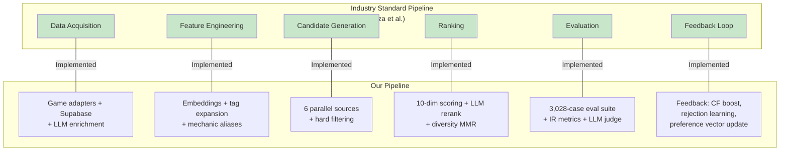

### Key Equation (from literature)

The standard hybrid recommendation formula:
```
r_hat(u,i) = alpha * f_CB(u,i) + beta * f_CF(u,i)
```

Our implementation:
```
final_score = 0.65 * rule_based_score + 0.35 * cosine_similarity
              + 0.15 * CF_boost (when available)
              - rejection_penalty (from "Not This" history)
```

**Difference from literature:** Our alpha/beta are static and hand-tuned. The literature recommends learning these from data (meta-learner). Koch specifically advocates for a trained last-stage blending model. We don't have enough user data for this yet.

---

## What I Think I'm Doing Right

1. **Hybrid multi-layer architecture** -- Validated by all sources as the correct pattern
2. **Questionnaire-first for cold start** -- Game-specific research explicitly validates this
3. **LLM for parsing, not for ranking** -- Matches 2024-2025 industry consensus
4. **Diversity enforcement via MMR** -- Standard technique, conservative lambda=0.12
5. **Progressive fallback chain** -- Guarantees non-empty results
6. **Rejection learning from "Not This"** -- Novel, addresses a real user pain point
7. **Multiple candidate sources in parallel** -- Maximizes recall
8. **Hard constraints before scoring** -- Computationally efficient, correct pipeline order
9. **Human-readable explanations** -- 74% of users want "why" (research-backed)
10. **Bayesian rating adjustment** -- Handles low-vote games correctly
11. **Eval-driven development** -- Changes measured against baseline, not vibes
12. **100% semantic embedding coverage** -- Eliminated hash-based fallback

---

## What I Think Is Wrong

### Critical Issues

1. **Catalog coverage is 0.5%** -- Only ~400 of 81,000 games ever get recommended per eval run. This means the scoring engine never even SEES most games. The candidate generation stage is the bottleneck.

2. **Mechanic-focused queries are 32% pass rate** -- When someone asks "deck building game," they expect Dominion. The engine returns correct but obscure deck builders. The BGG mechanic alias map helps but doesn't fully solve this.

3. **Genre expansion is too fuzzy** -- 70 static aliases create false positives. "Strategy" matches too many things. Should use semantic similarity between tag embeddings instead.

4. **Static weights can't adapt to query type** -- We have adaptive amplification (2x boost for tight player count, etc.) but the base weights are still hand-tuned. Koch says this should be a learned meta-model.

### Moderate Issues

5. **LLM-as-judge uses 0-10 pointwise scoring** -- Research says pairwise comparison ("Is A or B better?") is more reliable. Should upgrade.

6. **No A/B testing in production** -- All evaluation is offline. Netflix found offline-online correlation is only r=0.52-0.78.

7. **Collaborative filtering is effectively dormant** -- BPR is implemented but needs user data. The frequency-based CF only activates with 3+ reviews.

8. **Missing intent preservation in scoring** -- "Like Catan but less random" gets parsed into structured fields but the comparative relationship is partially lost.

9. **Constraint violations from free text are partially addressed** -- LLM-parsed complexity/player count is merged into the body, but only when the client sent defaults.

### Minor Issues

10. **9.6s p50 latency** -- Acceptable but not great. LLM calls dominate. Could improve with prompt caching or pre-computation.

11. **No confidence intervals on eval metrics** -- We report point estimates, not statistical significance.

12. **Eval ground truth for LLM-generated cases may be noisy** -- 2,700 of 3,028 cases were generated by GPT-4o. Their ideal/anti game assignments could be wrong.

---

## Key Decisions

| Decision | Why | Tradeoff |
|----------|-----|----------|
| Supabase (Postgres + pgvector) over Firebase | Need vector search + full SQL for recommendations | Newer service, smaller community |
| OpenAI over local models | Quality of parsing/reranking matters more than cost/latency | Vendor dependency, ~$0.01-0.05 per request |
| Rule-based scoring + LLM rerank over pure ML ranking | Don't have training data for ML yet | Manual weight tuning, less adaptive |
| 10 scoring dimensions over fewer | Each captures a distinct user need axis | Complexity, potential for interaction effects |
| Questionnaire-first over search-first | Cold start needs structured signal collection | More friction before first recommendation |
| Guest-first UX | Requiring signup kills conversion | Complex state management (localStorage + DB) |
| 81k game catalog over curated subset | Comprehensive coverage, long-tail discovery | More noise, harder to rank well |
| TypeScript everything over Python ML sidecar | One language, one deploy, simpler ops | Limits ML library access |

---

## File Reference

### Recommendation Engine Core

| File | Lines | Purpose |
|------|-------|---------|
| `src/app/api/recommend/route.ts` | 1,227 | Main orchestrator -- all 9 pipeline stages |
| `src/lib/recommendation/scoring.ts` | 1,230 | 10-dimension scorer with adaptive weights |
| `src/lib/recommendation/similarity.ts` | 246 | pgvector search + in-memory cosine reranking |
| `src/lib/recommendation/embeddings.ts` | ~300 | Hash-based + semantic embedding generation |
| `src/lib/recommendation/llm-rerank.ts` | ~200 | GPT-4o-mini semantic reranking |
| `src/lib/recommendation/diversity.ts` | ~150 | MMR algorithm for result diversity |
| `src/lib/recommendation/collaborative.ts` | ~300 | User-user + item-item collaborative filtering |
| `src/lib/recommendation/feedback-loop.ts` | ~250 | Preference vector updates from user feedback |
| `src/lib/recommendation/rejection.ts` | ~150 | Tag-based rejection learning from "Not This" |
| `src/lib/recommendation/mechanic-aliases.ts` | 106 | BGG mechanic naming gap bridge (67 aliases) |
| `src/lib/recommendation/llm-query-expand.ts` | ~100 | Creative search term generation |
| `src/lib/recommendation/popularity-cache.ts` | ~250 | Pre-computed popularity lists (38 lists, 1,390 games) |
| `src/lib/recommendation/bpr.ts` | ~300 | Bayesian Personalized Ranking (ready, not active) |
| `src/lib/llm/parse-preferences.ts` | ~300 | LLM free text -> structured preferences |

### Evaluation System

| File | Lines | Purpose |
|------|-------|---------|
| `evals/runner.ts` | 626 | Core eval runner (parallel, LLM judge, regression tracking) |
| `evals/types.ts` | 219 | Type system for cases, results, metrics |
| `evals/metrics.ts` | 109 | NDCG, Precision, MRR, Hit Rate calculations |
| `evals/llm-judge.ts` | 105 | GPT-4o-mini quality scoring |
| `evals/constraint-checker.ts` | 110 | Player/time/complexity violation detection |
| `evals/compare-runs.ts` | 139 | Side-by-side run comparison |
| `evals/analyze-failures.ts` | 254 | Failure pattern categorization |
| `evals/cases.json` | 1.6MB | 3,028 test cases across 16 categories |
| `evals/generate-cases.ts` | ~1,500 | 130 hand-curated base case generator |
| `evals/generate-expanded-cases.ts` | ~800 | +177 systematic variation generator |
| `evals/generate-massive.ts` | ~800 | LLM-generated case bulk generator |

### Documentation

| File | Purpose |
|------|---------|
| `docs/ARCHITECTURE.md` | System architecture with 6 Mermaid diagrams |
| `docs/RECOMMENDATION-ENGINE.md` | 4-layer evolution design |
| `docs/RECOMMENDATION-ENGINE-RESEARCH.md` | Academic literature analysis (650+ lines) |
| `docs/research/recommendation-eval-methodology.md` | Deep eval methodology research (800 lines) |
| `evals/EVAL-OVERVIEW.md` | Complete eval system guide |
| `evals/EVAL-WORKLOG.md` | Narrative log of all eval findings |
| `evals/RECOMMENDATIONS.md` | 7 prioritized engine improvements from eval data |
| `docs/DECISIONS.md` | Architecture Decision Records |

---

## How to Explore the Codebase

```bash
# Clone and install
git clone <repo>
npm install

# Run the dev server
npm run dev  # localhost:1337

# Run the eval suite
npm run eval              # Full suite with LLM judge (~12-40 min)
npm run eval:quick        # 50 cases, no judge (~2 min)
npm run eval:summary      # View latest run
npm run eval:compare      # Compare last 2 runs
npm run eval:analyze      # Failure pattern analysis

# Run tests
npm run test:run          # All unit tests
npx vitest run src/lib/recommendation/scoring.test.ts  # Specific file

# Filter evals by category
npx tsx evals/runner.ts --category=mechanic-focused
npx tsx evals/runner.ts --tag=regression
```

---

## Questions for Reviewers

1. **Scoring architecture:** Is 10 dimensions with hand-tuned weights the right approach, or should I collapse to fewer dimensions and let a meta-learner optimize? At what user data volume does this become worth it?

2. **Candidate generation:** With 7 parallel sources (vector, tag, text, mechanic, designer, LLM expansion, canonical games) and 500-1000 candidates, am I over-fetching or under-fetching? The 0.5% catalog coverage suggests the problem is in which 500 I'm fetching, not how many.

3. **Evaluation blind spots:** The eval suite tests "did the right games appear?" but not "did the user feel satisfied?" -- is there a practical way to bridge this offline?

4. **LLM integration points:** I use LLMs in 4 places (parsing, query expansion, reranking, metadata enrichment). Are any of these misplaced? Should the LLM be doing more or less?

5. **Diversity vs. accuracy tradeoff:** MMR with lambda=0.12 (88% relevance, 12% novelty). Is this the right balance for a game recommendation domain?

6. **Cold start strategy:** The questionnaire collects rich preferences, but are there better signals to collect? Should I be asking different questions?

7. **Priority call:** If you could change one thing, what would it be?
