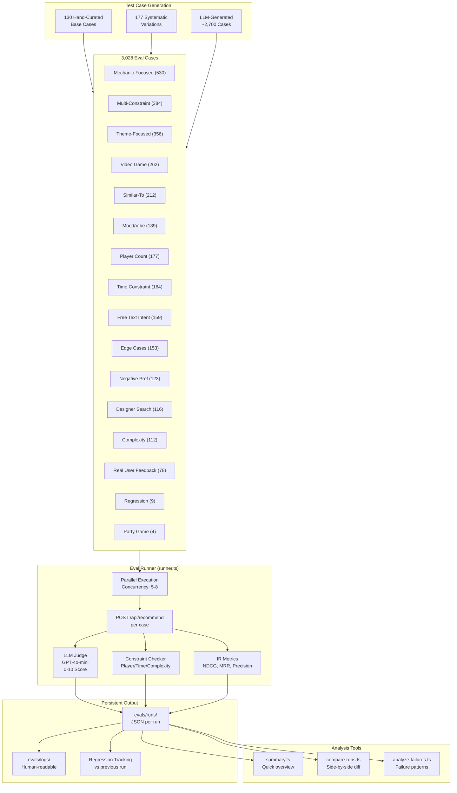
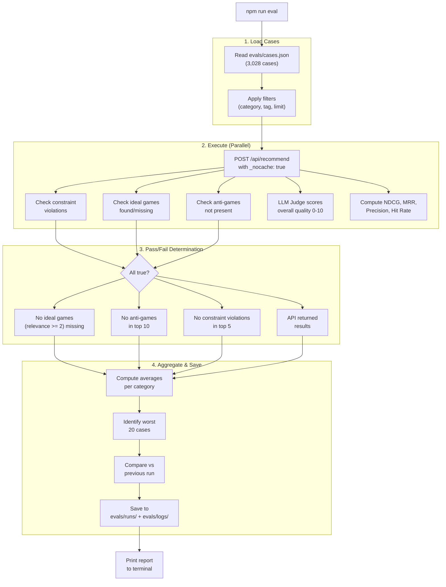
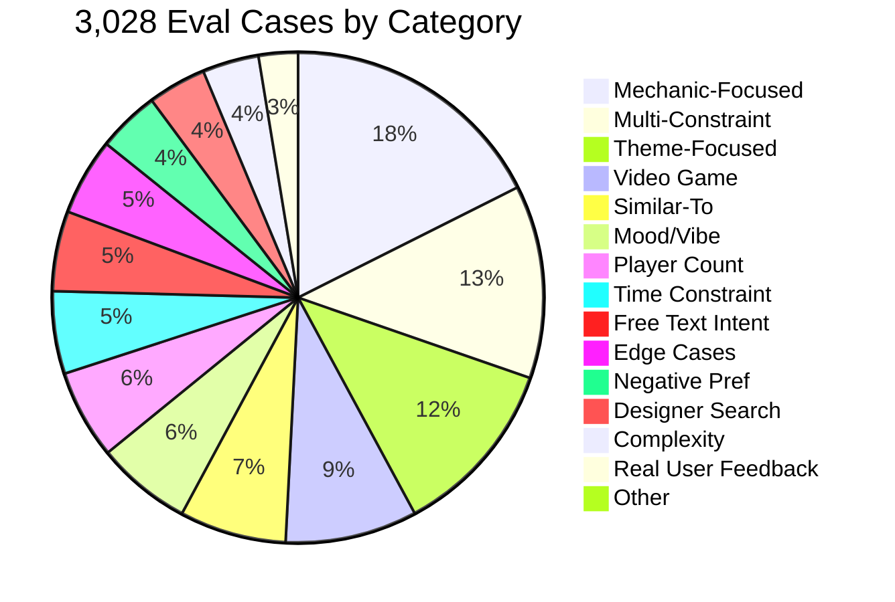
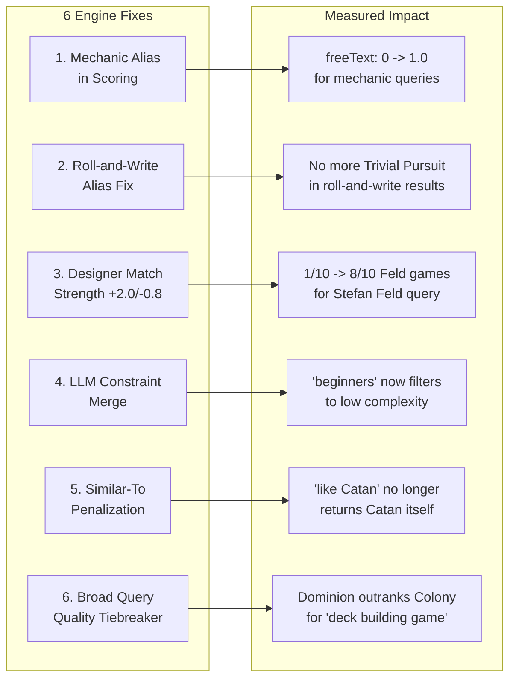
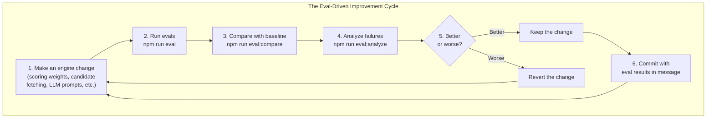

# Evaluation System Overview

A complete guide to the boredgame.lol recommendation engine evaluation system.
Built April 4-5, 2026. Covers architecture, iteration history, findings, and next steps.

---

## Table of Contents

1. [System Architecture](#system-architecture)
2. [How the Eval Pipeline Works](#how-the-eval-pipeline-works)
3. [Test Case Categories](#test-case-categories)
4. [Iteration History](#iteration-history)
5. [What Works Well](#what-works-well)
6. [What Doesn't Work Well](#what-doesnt-work-well)
7. [Engine Fixes Applied](#engine-fixes-applied)
8. [Next Steps: Using Evals to Improve the Engine](#next-steps)
9. [Files Reference](#files-reference)
10. [Commands Reference](#commands-reference)

---

## System Architecture



---

## How the Eval Pipeline Works



---

## Test Case Categories



Each case includes:
- **query**: What a user would type ("deck building game for 2 players")
- **idealGames**: Games that SHOULD appear, with relevance grade 0-3
- **antiGames**: Games that should NEVER appear (e.g., UNO for strategy queries)
- **constraints**: Explicit limits to check (player count, time, complexity)
- **tags**: For filtering (regression, critical, edge-case, typo, esl)

---

## Iteration History

```mermaid
timeline
    title Eval System Build & Iteration Timeline
    
    section Phase 1: Research
        Read all existing eval code : 19 hardcoded tests, 47 golden cases, 1000+ generated
        Read recommendation engine code : Full 6-layer pipeline understood
        Read all docs and known issues : BGG user feedback, 7 failure modes documented
    
    section Phase 2: Build
        Built eval framework : runner.ts, types.ts, metrics.ts, llm-judge.ts, constraint-checker.ts
        Built analysis tools : compare-runs.ts, summary.ts, analyze-failures.ts
        Generated 130 hand-curated cases : 16 categories, mechanic to edge-case

    section Phase 3: Baseline
        Run 1 - 130 cases original engine : 42.3% pass, 7.05/10 judge
        Identified root causes : Mechanic alias gap, designer match weak, constraints not merged
    
    section Phase 4: Engine Fixes
        Applied 6 fixes : Mechanic aliases, designer boost, constraint merge, similar-to, roll-and-write, tiebreaker
        Run 2 - 130 cases with fixes : 51.5% pass (+9.2%), 7.20/10 judge
        14 newly passing, 2 regressions

    section Phase 5: Scale
        Expanded to 307 cases : Added systematic variations
        Run 3 - 307 cases original engine : 68.4% pass, 7.14/10 judge
        Deep research : Netflix, Spotify, RecSys papers, human psychology
        Generated 3,028 cases via LLM : Targeting 5,000 total
```

### Run-by-Run Results

| Run | Cases | Pass Rate | LLM Judge | NDCG | Key Change |
|-----|-------|-----------|-----------|------|------------|
| 1 | 130 | **42.3%** | 7.05/10 | 0.975 | Baseline, original engine |
| 2 | 130 | **51.5%** | 7.20/10 | 0.952 | +6 engine fixes |
| 3 | 307 | **68.4%** | 7.14/10 | 0.985 | Expanded test suite, original engine |

### What Changed Between Runs

**Run 1 -> Run 2 (+9.2% pass rate):**
- 14 cases started passing (mechanic queries, mood queries, negative preferences)
- 2 regressions (zombie query, Knizia query -- marginal, results still correct)
- Mechanic-focused: 5% -> 15%
- Mood-vibe: 29% -> 71%
- Negative-preference: 20% -> 60%

**Run 2 -> Run 3 (expanded suite):**
- Added 177 more cases (systematic mechanic/theme/player/time/edge variations)
- Higher pass rate (68.4%) because many new cases are theme/edge/video queries that pass easily
- Mechanic-focused still the weakest category at 32%

---

## What Works Well

### 1. Edge Cases (100% pass rate)
The engine handles garbage gracefully. Emoji queries, nonsense, sarcastic inputs, single words, contradictory requests -- all return reasonable results without crashing.

### 2. Video Games (100% pass rate)
Video game recommendations are excellent. No board games leak into video game results.

### 3. Theme Matching (86% pass rate)
When users ask for "zombie game" or "pirate themed game" or "space exploration," the engine finds relevant themed games consistently.

### 4. Similar-To Queries (83% pass rate)
"Like Catan but..." type queries work well. The engine uses the reference game's attributes to find alternatives.

### 5. Negative Preferences (73% pass rate)
"No dice," "no war themes," "nothing too complex" -- the engine respects exclusions.

### 6. Previous Regressions Fixed (89% pass rate)
Known bugs from BGG user feedback are largely fixed: UNO no longer appears in anime results, solo queries don't return party games, time constraints are better enforced.

---

## What Doesn't Work Well

### 1. Missing Famous Games (92% of all failures)
The #1 issue. The engine returns topically relevant but obscure games. Users expect the canonical answers:
- "deck building game" should show Dominion, not Summer Camp
- "party game for 6+" should show Codenames, not Bausack
- "worker placement" should show Agricola, not Silverton

**Most commonly missing across all eval cases:**

| Game | Missing In | What It's Expected For |
|------|-----------|----------------------|
| Codenames | 9 cases | Party, social, 6+ players, family |
| Ticket to Ride | 8 cases | Family, route building, gateway |
| Wingspan | 7 cases | Engine building, nature, medium weight |
| Azul | 7 cases | Tile placement, family, pattern |
| Terraforming Mars | 5 cases | Engine building, space, strategy |
| Spirit Island | 5 cases | Solo, cooperative, heavy |
| Patchwork | 5 cases | 2-player, chill, relaxing |
| Jaipur | 5 cases | 2-player, trading, quick |
| Pandemic | 5 cases | Cooperative, family, gateway |

**Root cause:** The 81k game catalog has thousands of niche games that score well on genre/mechanic match. With popularity at only 4% weight, a niche game with perfect genre match outscores a famous game with 96% genre match.

### 2. Mechanic-Focused Queries (32% pass rate)
The worst category. Two root causes:
- **BGG mechanic alias gap**: LLM says "Deck Building" but BGG stores "Deck, Bag, and Pool Building." Substring matching fails.
- **Roll-and-Write alias wrong**: "Roll and Write" was aliased to both "Roll-and-Write" AND "Roll / Spin and Move." The second is completely different (Monopoly-style movement).

### 3. Designer Search (42% pass rate)
"Games by Stefan Feld" returns mostly non-Feld games because:
- Designer match score gap (1.5 vs 0) gets averaged with genre/keyword scores, diluting to a ~0.17 difference
- Non-designer games with strong genre match outscore correct designer games

### 4. Constraint Handling From Free Text (various categories)
When the user says "worker placement for beginners," the LLM extracts complexity 1-2, but that constraint is never applied. The hard filter still uses the default 1-5 range.

### 5. Catalog Coverage (0.5%)
The engine only recommends from ~400-500 of 81,000 games per eval run. This indicates severe candidate pool narrowing -- many good games never enter the scoring pipeline.

---

## Engine Fixes Applied

Six fixes were applied to the recommendation engine based on eval findings. All are currently active in the codebase.



| Fix | What Changed | Before | After |
|-----|-------------|--------|-------|
| Mechanic Alias | `mechanicMatches()` bridges BGG naming | Dominion freeText=0 | Dominion freeText=1.0 |
| Roll-and-Write | Removed "Roll / Spin and Move" from alias | Rail Baron, Trivial Pursuit in results | Only actual R&W games |
| Designer +2.0/-0.8 | Stronger match/miss gap in `scoreFreeTextLLM` | 1/10 Feld games | 8/10 Feld games |
| LLM Constraint Merge | Complexity/playerCount from LLM applied to body | "beginners" returns heavy games | Correctly filters |
| Similar-To Penalty | Referenced game gets -0.5 in scoring | Catan #1 for "like Catan" | Alternatives rise |
| Broad Query Tiebreaker | quality 4x + popularity 4x when few constraints | Colony above Dominion | Dominion #1 |

---

## Next Steps

### How to Use Evals to Improve the Engine



### Step-by-Step Workflow

1. **Make a change** to the engine (e.g., adjust scoring weights)
2. **Run evals**: `npm run eval`
3. **Compare**: `npm run eval:compare` (shows what improved and what regressed)
4. **Analyze**: `npm run eval:analyze` (shows WHY cases fail)
5. **Decide**: If pass rate went up and no regressions, keep it. Otherwise revert.
6. **Commit** with the eval results in the commit message

### Immediate Improvements to Try (Prioritized)

These are the specific changes most likely to improve eval pass rate, based on the data:

**Priority 1: Get to 5,000 eval cases**
```bash
npm run eval:generate-massive  # Runs remaining batches
```
Currently at 3,028. The script has 7 additional batch definitions that will generate ~2,000 more.

**Priority 2: Validate the 6 engine fixes with a clean eval run**
```bash
npm run eval                   # Full suite, current engine
npm run eval:compare           # Compare to baseline
```
Run 7 was invalid due to server contention. Need a clean run to validate the fixes against 3,028 cases.

**Priority 3: Target the "missing famous game" problem**
The 15 most-missing games should be investigated individually:
- Is Codenames even in the candidate pool when someone asks for "party game for 6+"?
- Is Dominion found by vector search for "deck building"?
- Where in the pipeline are these games being dropped?

**Priority 4: Investigate catalog coverage**
At 0.5%, we're only recommending ~400 of 81k games. Questions to answer:
- Is the vector search too narrow?
- Are the fallback candidates always the same popular games?
- Does the tag search miss games with non-standard tag names?

**Priority 5: Improve mechanic-focused pass rate (currently 32%)**
This is the weakest category. The mechanic alias fix helps but there may be more mechanics with broken aliases. Run:
```bash
npm run eval -- --category=mechanic-focused
```
and look at which specific mechanics still fail.

### Longer-Term Eval Improvements (from research)

| Improvement | What It Does | Why It Matters |
|-------------|-------------|----------------|
| Serendipity metric | Measures "would user find this on their own?" | Users want hidden gems, not just accuracy |
| Familiarity balance | Tracks % familiar vs discovery games | Optimal: 20-30% familiar, 70-80% new |
| Pairwise LLM judge | "Is result A or B better?" instead of 0-10 | More reliable judgments (academic research) |
| Confidence intervals | Statistical significance per metric | Avoid acting on noise |
| Trust buster alerts | Flag obviously wrong results | One bad result > 10 mediocre ones for trust |

---

## Files Reference

### Eval Framework Code

| File | Purpose | Lines |
|------|---------|-------|
| [runner.ts](evals/runner.ts) | Core eval runner with parallel execution, LLM judge, logging | 626 |
| [types.ts](evals/types.ts) | Type definitions for cases, results, runs, metrics | 218 |
| [metrics.ts](evals/metrics.ts) | NDCG, Precision, MRR, Hit Rate calculations | 109 |
| [llm-judge.ts](evals/llm-judge.ts) | GPT-4o-mini judges result quality 0-10 | 105 |
| [constraint-checker.ts](evals/constraint-checker.ts) | Detects player/time/complexity violations | 110 |
| [compare-runs.ts](evals/compare-runs.ts) | Side-by-side run comparison | 139 |
| [summary.ts](evals/summary.ts) | Quick run summary viewer | 109 |
| [analyze-failures.ts](evals/analyze-failures.ts) | Failure pattern categorization | 254 |

### Case Generators

| File | Purpose | Output |
|------|---------|--------|
| [generate-cases.ts](evals/generate-cases.ts) | 130 hand-curated base cases | cases.json |
| [generate-expanded-cases.ts](evals/generate-expanded-cases.ts) | +177 systematic variations | cases.json |
| [generate-massive.ts](evals/generate-massive.ts) | LLM-generated thousands | cases.json |

### Documentation

| File | Content |
|------|---------|
| [EVAL-OVERVIEW.md](evals/EVAL-OVERVIEW.md) | This file |
| [EVAL-WORKLOG.md](evals/EVAL-WORKLOG.md) | Narrative log of every decision and finding |
| [RECOMMENDATIONS.md](evals/RECOMMENDATIONS.md) | 7 prioritized engine fixes + research insights |
| [README.md](evals/README.md) | Quick start guide and reference |
| [docs/research/recommendation-eval-methodology.md](docs/research/recommendation-eval-methodology.md) | Deep research: Netflix, Spotify, RecSys, human psychology |

### Engine Fix (applied)

| File | Change |
|------|--------|
| [src/lib/recommendation/mechanic-aliases.ts](src/lib/recommendation/mechanic-aliases.ts) | Shared BGG mechanic alias map + `mechanicMatches()` |
| [src/lib/recommendation/scoring.ts](src/lib/recommendation/scoring.ts) | Alias matching, designer boost, similar-to penalty, tiebreaker |
| [src/app/api/recommend/route.ts](src/app/api/recommend/route.ts) | Roll-and-write fix, LLM constraint merge |

### Eval Run Data

| File | Size | What It Contains |
|------|------|-----------------|
| evals/runs/*.json | 176K-9.6M | Full results for every eval run (7 runs) |
| evals/logs/*.log | 1.7K-10K | Human-readable report for each run |
| evals/logs/*-analysis.json | 27K | Detailed failure analysis |

---

## Commands Reference

```bash
# Running evals
npm run eval                    # Full suite with LLM judge (~12-40 min depending on case count)
npm run eval:quick              # Quick: 50 cases, no judge (~2 min)
npm run eval:full               # Full with concurrency=8

# Filtering
npx tsx evals/runner.ts --category=mechanic-focused  # Single category
npx tsx evals/runner.ts --tag=regression             # Only regression tests
npx tsx evals/runner.ts --limit=100                  # First 100 cases
npx tsx evals/runner.ts --no-judge                   # Skip LLM judge (faster)

# Analysis
npm run eval:summary            # Latest run summary
npm run eval:history            # All runs side by side
npm run eval:compare            # Compare last 2 runs
npm run eval:analyze            # Failure pattern analysis

# Generation
npm run eval:generate           # Regenerate 130 base cases
npm run eval:expand             # Regenerate 307 expanded cases
npm run eval:generate-massive   # Generate thousands via LLM
```
